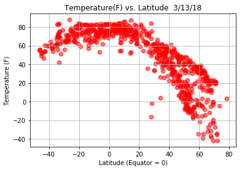
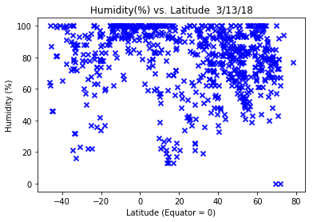
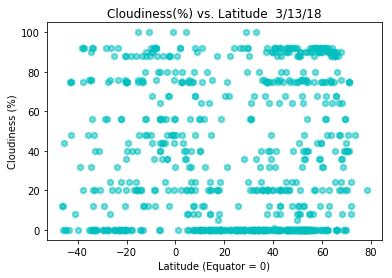
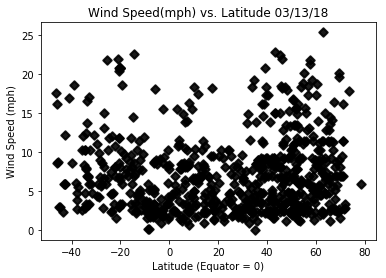

```python
# Dependencies
import json
import requests as req
from citipy import citipy
import matplotlib.pyplot as plt
import numpy as np
import pandas as pd
from config import api_key
import csv
import urllib
import openweathermapy.core as own

```


```python
# Setting the initial empty lists
lat_lgns = []
citi1 = []

```


```python
# Setting the parameters for latitude and longitude
lat = np.random.uniform(low = -90.000, high = 90.000,size = 1100)
lon = np.random.uniform(low = 0.000, high = 180.000,size = 1100)
lat_lons = zip(lat,lon)
```


```python
#Using Citipy module for selecting (500) cities randomly based on lat & lng. 

for lat_lon in lat_lons:
    citi2 = citipy.nearest_city(lat_lon[0],lat_lon[1]).city_name
    
    if citi2 not in citi1:
        citi1.append(citi2)
len(citi1)
```


    799


```python
# Base API URL 
url = "http://api.openweathermap.org/data/2.5/weather?units=Imperial&APPID=" + api_key

# Emtpy list to hold retrieved data for cities
equator_list = []

# Message to indicate the beginning of the API Call
print('Start of API Call')

#Added a counters to message the calling limitition set by Open Weather.
counter = 1
counter2 = 1

#Loop through the list of randomly selected cities

for x, citi2 in enumerate(citi1):
    if(x % 50 == 0 and x >= 50):
        counter2 += 1
        counter = 0
    
    # Create url with specific city
    query_url = url + "&q=" + urllib.request.pathname2url(citi2)
    print(query_url)
    counter += 1
    try:
        
#Run requests to grab the JSON at the query_url
        response = req.get(query_url)
        response_json = response.json()

# Creating list of blank columns for loop to store data.
        a = response_json["coord"]["lat"]
        b = response_json["coord"]["lon"]
        c = response_json["main"]["temp"] 
        d = response_json["main"]["humidity"]
        e = response_json["name"]
        f = response_json["clouds"]["all"]
        g = response_json["wind"]["speed"]
    
# Add each value to the appropriate array {Dictionay should be built veritically}    
        equator_list.append({"Lat": a, 
                             "Lon": b,
                             "Temp": c, 
                             "Humidity": d, 
                             "Name": e, 
                             "All": f, 
                             "Speed": g})
    except:
        print("Not Printing Error")
        pass
print('End of API Call')   
```

    Start of API Call
    http://api.openweathermap.org/data/2.5/weather?units=Imperial&APPID=80de8523626684d5af1b3fc66582eafb&q=bluff
    http://api.openweathermap.org/data/2.5/weather?units=Imperial&APPID=80de8523626684d5af1b3fc66582eafb&q=east%20london
    http://api.openweathermap.org/data/2.5/weather?units=Imperial&APPID=80de8523626684d5af1b3fc66582eafb&q=quatre%20cocos
    http://api.openweathermap.org/data/2.5/weather?units=Imperial&APPID=80de8523626684d5af1b3fc66582eafb&q=palauig
    http://api.openweathermap.org/data/2.5/weather?units=Imperial&APPID=80de8523626684d5af1b3fc66582eafb&q=toora-khem
    http://api.openweathermap.org/data/2.5/weather?units=Imperial&APPID=80de8523626684d5af1b3fc66582eafb&q=victoria
    http://api.openweathermap.org/data/2.5/weather?units=Imperial&APPID=80de8523626684d5af1b3fc66582eafb&q=karaul
    Not Printing Error
    http://api.openweathermap.org/data/2.5/weather?units=Imperial&APPID=80de8523626684d5af1b3fc66582eafb&q=inhambane
    http://api.openweathermap.org/data/2.5/weather?units=Imperial&APPID=80de8523626684d5af1b3fc66582eafb&q=butaritari
    http://api.openweathermap.org/data/2.5/weather?units=Imperial&APPID=80de8523626684d5af1b3fc66582eafb&q=isangel
    http://api.openweathermap.org/data/2.5/weather?units=Imperial&APPID=80de8523626684d5af1b3fc66582eafb&q=tancheng
    http://api.openweathermap.org/data/2.5/weather?units=Imperial&APPID=80de8523626684d5af1b3fc66582eafb&q=biak
    http://api.openweathermap.org/data/2.5/weather?units=Imperial&APPID=80de8523626684d5af1b3fc66582eafb&q=hermanus
    http://api.openweathermap.org/data/2.5/weather?units=Imperial&APPID=80de8523626684d5af1b3fc66582eafb&q=anadyr
    http://api.openweathermap.org/data/2.5/weather?units=Imperial&APPID=80de8523626684d5af1b3fc66582eafb&q=albany
    http://api.openweathermap.org/data/2.5/weather?units=Imperial&APPID=80de8523626684d5af1b3fc66582eafb&q=hambantota
    http://api.openweathermap.org/data/2.5/weather?units=Imperial&APPID=80de8523626684d5af1b3fc66582eafb&q=nemuro
    http://api.openweathermap.org/data/2.5/weather?units=Imperial&APPID=80de8523626684d5af1b3fc66582eafb&q=clyde
    http://api.openweathermap.org/data/2.5/weather?units=Imperial&APPID=80de8523626684d5af1b3fc66582eafb&q=hobart
    http://api.openweathermap.org/data/2.5/weather?units=Imperial&APPID=80de8523626684d5af1b3fc66582eafb&q=kudahuvadhoo
    http://api.openweathermap.org/data/2.5/weather?units=Imperial&APPID=80de8523626684d5af1b3fc66582eafb&q=saint-joseph
    http://api.openweathermap.org/data/2.5/weather?units=Imperial&APPID=80de8523626684d5af1b3fc66582eafb&q=boddam
    http://api.openweathermap.org/data/2.5/weather?units=Imperial&APPID=80de8523626684d5af1b3fc66582eafb&q=oranjemund
    http://api.openweathermap.org/data/2.5/weather?units=Imperial&APPID=80de8523626684d5af1b3fc66582eafb&q=longyearbyen
    http://api.openweathermap.org/data/2.5/weather?units=Imperial&APPID=80de8523626684d5af1b3fc66582eafb&q=bredasdorp
    http://api.openweathermap.org/data/2.5/weather?units=Imperial&APPID=80de8523626684d5af1b3fc66582eafb&q=belushya%20guba
    Not Printing Error
    http://api.openweathermap.org/data/2.5/weather?units=Imperial&APPID=80de8523626684d5af1b3fc66582eafb&q=leh
    http://api.openweathermap.org/data/2.5/weather?units=Imperial&APPID=80de8523626684d5af1b3fc66582eafb&q=asau
    Not Printing Error
    http://api.openweathermap.org/data/2.5/weather?units=Imperial&APPID=80de8523626684d5af1b3fc66582eafb&q=bambous%20virieux
    http://api.openweathermap.org/data/2.5/weather?units=Imperial&APPID=80de8523626684d5af1b3fc66582eafb&q=amderma
    Not Printing Error
    http://api.openweathermap.org/data/2.5/weather?units=Imperial&APPID=80de8523626684d5af1b3fc66582eafb&q=santa%20josefa
    http://api.openweathermap.org/data/2.5/weather?units=Imperial&APPID=80de8523626684d5af1b3fc66582eafb&q=namibe
    http://api.openweathermap.org/data/2.5/weather?units=Imperial&APPID=80de8523626684d5af1b3fc66582eafb&q=port%20alfred
    http://api.openweathermap.org/data/2.5/weather?units=Imperial&APPID=80de8523626684d5af1b3fc66582eafb&q=arlit
    http://api.openweathermap.org/data/2.5/weather?units=Imperial&APPID=80de8523626684d5af1b3fc66582eafb&q=basoko
    http://api.openweathermap.org/data/2.5/weather?units=Imperial&APPID=80de8523626684d5af1b3fc66582eafb&q=kemijarvi
    Not Printing Error
    http://api.openweathermap.org/data/2.5/weather?units=Imperial&APPID=80de8523626684d5af1b3fc66582eafb&q=new%20norfolk
    http://api.openweathermap.org/data/2.5/weather?units=Imperial&APPID=80de8523626684d5af1b3fc66582eafb&q=chokurdakh
    http://api.openweathermap.org/data/2.5/weather?units=Imperial&APPID=80de8523626684d5af1b3fc66582eafb&q=bengkulu
    Not Printing Error
    http://api.openweathermap.org/data/2.5/weather?units=Imperial&APPID=80de8523626684d5af1b3fc66582eafb&q=nalut
    http://api.openweathermap.org/data/2.5/weather?units=Imperial&APPID=80de8523626684d5af1b3fc66582eafb&q=busselton
    http://api.openweathermap.org/data/2.5/weather?units=Imperial&APPID=80de8523626684d5af1b3fc66582eafb&q=geraldton
    http://api.openweathermap.org/data/2.5/weather?units=Imperial&APPID=80de8523626684d5af1b3fc66582eafb&q=nikolskoye
    http://api.openweathermap.org/data/2.5/weather?units=Imperial&APPID=80de8523626684d5af1b3fc66582eafb&q=katsuura
    http://api.openweathermap.org/data/2.5/weather?units=Imperial&APPID=80de8523626684d5af1b3fc66582eafb&q=teya
    http://api.openweathermap.org/data/2.5/weather?units=Imperial&APPID=80de8523626684d5af1b3fc66582eafb&q=bolshaya%20yelkhovka
    Not Printing Error
    http://api.openweathermap.org/data/2.5/weather?units=Imperial&APPID=80de8523626684d5af1b3fc66582eafb&q=sur
    http://api.openweathermap.org/data/2.5/weather?units=Imperial&APPID=80de8523626684d5af1b3fc66582eafb&q=bireun
    http://api.openweathermap.org/data/2.5/weather?units=Imperial&APPID=80de8523626684d5af1b3fc66582eafb&q=batemans%20bay
    http://api.openweathermap.org/data/2.5/weather?units=Imperial&APPID=80de8523626684d5af1b3fc66582eafb&q=severo-kurilsk
    http://api.openweathermap.org/data/2.5/weather?units=Imperial&APPID=80de8523626684d5af1b3fc66582eafb&q=sistranda
    http://api.openweathermap.org/data/2.5/weather?units=Imperial&APPID=80de8523626684d5af1b3fc66582eafb&q=gat
    http://api.openweathermap.org/data/2.5/weather?units=Imperial&APPID=80de8523626684d5af1b3fc66582eafb&q=saint-philippe
    http://api.openweathermap.org/data/2.5/weather?units=Imperial&APPID=80de8523626684d5af1b3fc66582eafb&q=lorengau
    http://api.openweathermap.org/data/2.5/weather?units=Imperial&APPID=80de8523626684d5af1b3fc66582eafb&q=sentyabrskiy
    Not Printing Error
    http://api.openweathermap.org/data/2.5/weather?units=Imperial&APPID=80de8523626684d5af1b3fc66582eafb&q=vinh
    http://api.openweathermap.org/data/2.5/weather?units=Imperial&APPID=80de8523626684d5af1b3fc66582eafb&q=kamenskoye
    Not Printing Error
    http://api.openweathermap.org/data/2.5/weather?units=Imperial&APPID=80de8523626684d5af1b3fc66582eafb&q=haarby
    Not Printing Error
    http://api.openweathermap.org/data/2.5/weather?units=Imperial&APPID=80de8523626684d5af1b3fc66582eafb&q=lata
    http://api.openweathermap.org/data/2.5/weather?units=Imperial&APPID=80de8523626684d5af1b3fc66582eafb&q=orshanka
    http://api.openweathermap.org/data/2.5/weather?units=Imperial&APPID=80de8523626684d5af1b3fc66582eafb&q=karpathos
    http://api.openweathermap.org/data/2.5/weather?units=Imperial&APPID=80de8523626684d5af1b3fc66582eafb&q=tilichiki
    http://api.openweathermap.org/data/2.5/weather?units=Imperial&APPID=80de8523626684d5af1b3fc66582eafb&q=puteyets
    http://api.openweathermap.org/data/2.5/weather?units=Imperial&APPID=80de8523626684d5af1b3fc66582eafb&q=pindi%20bhattian
    http://api.openweathermap.org/data/2.5/weather?units=Imperial&APPID=80de8523626684d5af1b3fc66582eafb&q=maltahohe
    http://api.openweathermap.org/data/2.5/weather?units=Imperial&APPID=80de8523626684d5af1b3fc66582eafb&q=port%20elizabeth
    http://api.openweathermap.org/data/2.5/weather?units=Imperial&APPID=80de8523626684d5af1b3fc66582eafb&q=kushima
    http://api.openweathermap.org/data/2.5/weather?units=Imperial&APPID=80de8523626684d5af1b3fc66582eafb&q=potiskum
    http://api.openweathermap.org/data/2.5/weather?units=Imperial&APPID=80de8523626684d5af1b3fc66582eafb&q=zeya
    http://api.openweathermap.org/data/2.5/weather?units=Imperial&APPID=80de8523626684d5af1b3fc66582eafb&q=barentsburg
    Not Printing Error
    http://api.openweathermap.org/data/2.5/weather?units=Imperial&APPID=80de8523626684d5af1b3fc66582eafb&q=ambilobe
    http://api.openweathermap.org/data/2.5/weather?units=Imperial&APPID=80de8523626684d5af1b3fc66582eafb&q=dustlik
    http://api.openweathermap.org/data/2.5/weather?units=Imperial&APPID=80de8523626684d5af1b3fc66582eafb&q=carnarvon
    http://api.openweathermap.org/data/2.5/weather?units=Imperial&APPID=80de8523626684d5af1b3fc66582eafb&q=aksu
    http://api.openweathermap.org/data/2.5/weather?units=Imperial&APPID=80de8523626684d5af1b3fc66582eafb&q=novorudnyy
    http://api.openweathermap.org/data/2.5/weather?units=Imperial&APPID=80de8523626684d5af1b3fc66582eafb&q=petropavl
    http://api.openweathermap.org/data/2.5/weather?units=Imperial&APPID=80de8523626684d5af1b3fc66582eafb&q=noumea
    http://api.openweathermap.org/data/2.5/weather?units=Imperial&APPID=80de8523626684d5af1b3fc66582eafb&q=daru
    http://api.openweathermap.org/data/2.5/weather?units=Imperial&APPID=80de8523626684d5af1b3fc66582eafb&q=vardo
    http://api.openweathermap.org/data/2.5/weather?units=Imperial&APPID=80de8523626684d5af1b3fc66582eafb&q=tiksi
    http://api.openweathermap.org/data/2.5/weather?units=Imperial&APPID=80de8523626684d5af1b3fc66582eafb&q=binzhou
    http://api.openweathermap.org/data/2.5/weather?units=Imperial&APPID=80de8523626684d5af1b3fc66582eafb&q=burnie
    http://api.openweathermap.org/data/2.5/weather?units=Imperial&APPID=80de8523626684d5af1b3fc66582eafb&q=smidovich
    http://api.openweathermap.org/data/2.5/weather?units=Imperial&APPID=80de8523626684d5af1b3fc66582eafb&q=souillac
    http://api.openweathermap.org/data/2.5/weather?units=Imperial&APPID=80de8523626684d5af1b3fc66582eafb&q=marsa%20matruh
    http://api.openweathermap.org/data/2.5/weather?units=Imperial&APPID=80de8523626684d5af1b3fc66582eafb&q=beyneu
    http://api.openweathermap.org/data/2.5/weather?units=Imperial&APPID=80de8523626684d5af1b3fc66582eafb&q=ryki
    http://api.openweathermap.org/data/2.5/weather?units=Imperial&APPID=80de8523626684d5af1b3fc66582eafb&q=dikson
    http://api.openweathermap.org/data/2.5/weather?units=Imperial&APPID=80de8523626684d5af1b3fc66582eafb&q=dehloran
    http://api.openweathermap.org/data/2.5/weather?units=Imperial&APPID=80de8523626684d5af1b3fc66582eafb&q=vanimo
    http://api.openweathermap.org/data/2.5/weather?units=Imperial&APPID=80de8523626684d5af1b3fc66582eafb&q=jamestown
    http://api.openweathermap.org/data/2.5/weather?units=Imperial&APPID=80de8523626684d5af1b3fc66582eafb&q=esperance
    http://api.openweathermap.org/data/2.5/weather?units=Imperial&APPID=80de8523626684d5af1b3fc66582eafb&q=shimoda
    http://api.openweathermap.org/data/2.5/weather?units=Imperial&APPID=80de8523626684d5af1b3fc66582eafb&q=lipin%20bor
    http://api.openweathermap.org/data/2.5/weather?units=Imperial&APPID=80de8523626684d5af1b3fc66582eafb&q=rognan
    http://api.openweathermap.org/data/2.5/weather?units=Imperial&APPID=80de8523626684d5af1b3fc66582eafb&q=kuito
    http://api.openweathermap.org/data/2.5/weather?units=Imperial&APPID=80de8523626684d5af1b3fc66582eafb&q=kaitangata
    http://api.openweathermap.org/data/2.5/weather?units=Imperial&APPID=80de8523626684d5af1b3fc66582eafb&q=soverato
    http://api.openweathermap.org/data/2.5/weather?units=Imperial&APPID=80de8523626684d5af1b3fc66582eafb&q=saskylakh
    http://api.openweathermap.org/data/2.5/weather?units=Imperial&APPID=80de8523626684d5af1b3fc66582eafb&q=adrar
    http://api.openweathermap.org/data/2.5/weather?units=Imperial&APPID=80de8523626684d5af1b3fc66582eafb&q=bilibino
    http://api.openweathermap.org/data/2.5/weather?units=Imperial&APPID=80de8523626684d5af1b3fc66582eafb&q=rorvik
    http://api.openweathermap.org/data/2.5/weather?units=Imperial&APPID=80de8523626684d5af1b3fc66582eafb&q=barawe
    Not Printing Error
    http://api.openweathermap.org/data/2.5/weather?units=Imperial&APPID=80de8523626684d5af1b3fc66582eafb&q=vrangel
    http://api.openweathermap.org/data/2.5/weather?units=Imperial&APPID=80de8523626684d5af1b3fc66582eafb&q=yenagoa
    http://api.openweathermap.org/data/2.5/weather?units=Imperial&APPID=80de8523626684d5af1b3fc66582eafb&q=taolanaro
    Not Printing Error
    http://api.openweathermap.org/data/2.5/weather?units=Imperial&APPID=80de8523626684d5af1b3fc66582eafb&q=unecha
    http://api.openweathermap.org/data/2.5/weather?units=Imperial&APPID=80de8523626684d5af1b3fc66582eafb&q=salalah
    http://api.openweathermap.org/data/2.5/weather?units=Imperial&APPID=80de8523626684d5af1b3fc66582eafb&q=makasar
    http://api.openweathermap.org/data/2.5/weather?units=Imperial&APPID=80de8523626684d5af1b3fc66582eafb&q=yulara
    http://api.openweathermap.org/data/2.5/weather?units=Imperial&APPID=80de8523626684d5af1b3fc66582eafb&q=hithadhoo
    http://api.openweathermap.org/data/2.5/weather?units=Imperial&APPID=80de8523626684d5af1b3fc66582eafb&q=erzin
    http://api.openweathermap.org/data/2.5/weather?units=Imperial&APPID=80de8523626684d5af1b3fc66582eafb&q=rungata
    Not Printing Error
    http://api.openweathermap.org/data/2.5/weather?units=Imperial&APPID=80de8523626684d5af1b3fc66582eafb&q=katangli
    http://api.openweathermap.org/data/2.5/weather?units=Imperial&APPID=80de8523626684d5af1b3fc66582eafb&q=quang%20ngai
    http://api.openweathermap.org/data/2.5/weather?units=Imperial&APPID=80de8523626684d5af1b3fc66582eafb&q=gobabis
    http://api.openweathermap.org/data/2.5/weather?units=Imperial&APPID=80de8523626684d5af1b3fc66582eafb&q=port%20macquarie
    http://api.openweathermap.org/data/2.5/weather?units=Imperial&APPID=80de8523626684d5af1b3fc66582eafb&q=phuket
    http://api.openweathermap.org/data/2.5/weather?units=Imperial&APPID=80de8523626684d5af1b3fc66582eafb&q=akcaabat
    http://api.openweathermap.org/data/2.5/weather?units=Imperial&APPID=80de8523626684d5af1b3fc66582eafb&q=tukrah
    Not Printing Error
    http://api.openweathermap.org/data/2.5/weather?units=Imperial&APPID=80de8523626684d5af1b3fc66582eafb&q=tuatapere
    http://api.openweathermap.org/data/2.5/weather?units=Imperial&APPID=80de8523626684d5af1b3fc66582eafb&q=ozernovskiy
    http://api.openweathermap.org/data/2.5/weather?units=Imperial&APPID=80de8523626684d5af1b3fc66582eafb&q=bridlington
    http://api.openweathermap.org/data/2.5/weather?units=Imperial&APPID=80de8523626684d5af1b3fc66582eafb&q=tabiauea
    Not Printing Error
    http://api.openweathermap.org/data/2.5/weather?units=Imperial&APPID=80de8523626684d5af1b3fc66582eafb&q=mullaitivu
    Not Printing Error
    http://api.openweathermap.org/data/2.5/weather?units=Imperial&APPID=80de8523626684d5af1b3fc66582eafb&q=lerwick
    http://api.openweathermap.org/data/2.5/weather?units=Imperial&APPID=80de8523626684d5af1b3fc66582eafb&q=forssa
    http://api.openweathermap.org/data/2.5/weather?units=Imperial&APPID=80de8523626684d5af1b3fc66582eafb&q=nelson%20bay
    http://api.openweathermap.org/data/2.5/weather?units=Imperial&APPID=80de8523626684d5af1b3fc66582eafb&q=pevek
    http://api.openweathermap.org/data/2.5/weather?units=Imperial&APPID=80de8523626684d5af1b3fc66582eafb&q=svetlaya
    http://api.openweathermap.org/data/2.5/weather?units=Imperial&APPID=80de8523626684d5af1b3fc66582eafb&q=rehoboth
    http://api.openweathermap.org/data/2.5/weather?units=Imperial&APPID=80de8523626684d5af1b3fc66582eafb&q=skjervoy
    http://api.openweathermap.org/data/2.5/weather?units=Imperial&APPID=80de8523626684d5af1b3fc66582eafb&q=irbeyskoye
    http://api.openweathermap.org/data/2.5/weather?units=Imperial&APPID=80de8523626684d5af1b3fc66582eafb&q=mareeba
    http://api.openweathermap.org/data/2.5/weather?units=Imperial&APPID=80de8523626684d5af1b3fc66582eafb&q=sambava
    http://api.openweathermap.org/data/2.5/weather?units=Imperial&APPID=80de8523626684d5af1b3fc66582eafb&q=karaton
    http://api.openweathermap.org/data/2.5/weather?units=Imperial&APPID=80de8523626684d5af1b3fc66582eafb&q=luderitz
    http://api.openweathermap.org/data/2.5/weather?units=Imperial&APPID=80de8523626684d5af1b3fc66582eafb&q=richards%20bay
    http://api.openweathermap.org/data/2.5/weather?units=Imperial&APPID=80de8523626684d5af1b3fc66582eafb&q=prachuap%20khiri%20khan
    http://api.openweathermap.org/data/2.5/weather?units=Imperial&APPID=80de8523626684d5af1b3fc66582eafb&q=grand%20river%20south%20east
    Not Printing Error
    http://api.openweathermap.org/data/2.5/weather?units=Imperial&APPID=80de8523626684d5af1b3fc66582eafb&q=rovnoye
    http://api.openweathermap.org/data/2.5/weather?units=Imperial&APPID=80de8523626684d5af1b3fc66582eafb&q=nizhneyansk
    Not Printing Error
    http://api.openweathermap.org/data/2.5/weather?units=Imperial&APPID=80de8523626684d5af1b3fc66582eafb&q=leningradskiy
    http://api.openweathermap.org/data/2.5/weather?units=Imperial&APPID=80de8523626684d5af1b3fc66582eafb&q=dondo
    http://api.openweathermap.org/data/2.5/weather?units=Imperial&APPID=80de8523626684d5af1b3fc66582eafb&q=yetkul
    http://api.openweathermap.org/data/2.5/weather?units=Imperial&APPID=80de8523626684d5af1b3fc66582eafb&q=pangkalanbuun
    http://api.openweathermap.org/data/2.5/weather?units=Imperial&APPID=80de8523626684d5af1b3fc66582eafb&q=dawei
    http://api.openweathermap.org/data/2.5/weather?units=Imperial&APPID=80de8523626684d5af1b3fc66582eafb&q=znamenskoye
    http://api.openweathermap.org/data/2.5/weather?units=Imperial&APPID=80de8523626684d5af1b3fc66582eafb&q=methala
    http://api.openweathermap.org/data/2.5/weather?units=Imperial&APPID=80de8523626684d5af1b3fc66582eafb&q=te%20anau
    http://api.openweathermap.org/data/2.5/weather?units=Imperial&APPID=80de8523626684d5af1b3fc66582eafb&q=srednekolymsk
    http://api.openweathermap.org/data/2.5/weather?units=Imperial&APPID=80de8523626684d5af1b3fc66582eafb&q=skegness
    http://api.openweathermap.org/data/2.5/weather?units=Imperial&APPID=80de8523626684d5af1b3fc66582eafb&q=pribelskiy
    Not Printing Error
    http://api.openweathermap.org/data/2.5/weather?units=Imperial&APPID=80de8523626684d5af1b3fc66582eafb&q=ostrogozhsk
    http://api.openweathermap.org/data/2.5/weather?units=Imperial&APPID=80de8523626684d5af1b3fc66582eafb&q=kula
    http://api.openweathermap.org/data/2.5/weather?units=Imperial&APPID=80de8523626684d5af1b3fc66582eafb&q=port-gentil
    http://api.openweathermap.org/data/2.5/weather?units=Imperial&APPID=80de8523626684d5af1b3fc66582eafb&q=verkh-usugli
    http://api.openweathermap.org/data/2.5/weather?units=Imperial&APPID=80de8523626684d5af1b3fc66582eafb&q=honiara
    http://api.openweathermap.org/data/2.5/weather?units=Imperial&APPID=80de8523626684d5af1b3fc66582eafb&q=quelimane
    http://api.openweathermap.org/data/2.5/weather?units=Imperial&APPID=80de8523626684d5af1b3fc66582eafb&q=dicabisagan
    http://api.openweathermap.org/data/2.5/weather?units=Imperial&APPID=80de8523626684d5af1b3fc66582eafb&q=kalevala
    http://api.openweathermap.org/data/2.5/weather?units=Imperial&APPID=80de8523626684d5af1b3fc66582eafb&q=saldanha
    http://api.openweathermap.org/data/2.5/weather?units=Imperial&APPID=80de8523626684d5af1b3fc66582eafb&q=warrnambool
    http://api.openweathermap.org/data/2.5/weather?units=Imperial&APPID=80de8523626684d5af1b3fc66582eafb&q=malinta
    http://api.openweathermap.org/data/2.5/weather?units=Imperial&APPID=80de8523626684d5af1b3fc66582eafb&q=bilma
    http://api.openweathermap.org/data/2.5/weather?units=Imperial&APPID=80de8523626684d5af1b3fc66582eafb&q=xuddur
    http://api.openweathermap.org/data/2.5/weather?units=Imperial&APPID=80de8523626684d5af1b3fc66582eafb&q=pundaguitan
    http://api.openweathermap.org/data/2.5/weather?units=Imperial&APPID=80de8523626684d5af1b3fc66582eafb&q=tsihombe
    Not Printing Error
    http://api.openweathermap.org/data/2.5/weather?units=Imperial&APPID=80de8523626684d5af1b3fc66582eafb&q=henties%20bay
    http://api.openweathermap.org/data/2.5/weather?units=Imperial&APPID=80de8523626684d5af1b3fc66582eafb&q=maputo
    http://api.openweathermap.org/data/2.5/weather?units=Imperial&APPID=80de8523626684d5af1b3fc66582eafb&q=hasaki
    http://api.openweathermap.org/data/2.5/weather?units=Imperial&APPID=80de8523626684d5af1b3fc66582eafb&q=babati
    http://api.openweathermap.org/data/2.5/weather?units=Imperial&APPID=80de8523626684d5af1b3fc66582eafb&q=khatanga
    http://api.openweathermap.org/data/2.5/weather?units=Imperial&APPID=80de8523626684d5af1b3fc66582eafb&q=thespiai
    Not Printing Error
    http://api.openweathermap.org/data/2.5/weather?units=Imperial&APPID=80de8523626684d5af1b3fc66582eafb&q=loten
    http://api.openweathermap.org/data/2.5/weather?units=Imperial&APPID=80de8523626684d5af1b3fc66582eafb&q=ossora
    http://api.openweathermap.org/data/2.5/weather?units=Imperial&APPID=80de8523626684d5af1b3fc66582eafb&q=lixourion
    http://api.openweathermap.org/data/2.5/weather?units=Imperial&APPID=80de8523626684d5af1b3fc66582eafb&q=sawakin
    http://api.openweathermap.org/data/2.5/weather?units=Imperial&APPID=80de8523626684d5af1b3fc66582eafb&q=padang
    http://api.openweathermap.org/data/2.5/weather?units=Imperial&APPID=80de8523626684d5af1b3fc66582eafb&q=kloulklubed
    http://api.openweathermap.org/data/2.5/weather?units=Imperial&APPID=80de8523626684d5af1b3fc66582eafb&q=jiutai
    http://api.openweathermap.org/data/2.5/weather?units=Imperial&APPID=80de8523626684d5af1b3fc66582eafb&q=le%20port
    http://api.openweathermap.org/data/2.5/weather?units=Imperial&APPID=80de8523626684d5af1b3fc66582eafb&q=mecca
    http://api.openweathermap.org/data/2.5/weather?units=Imperial&APPID=80de8523626684d5af1b3fc66582eafb&q=vershino-darasunskiy
    http://api.openweathermap.org/data/2.5/weather?units=Imperial&APPID=80de8523626684d5af1b3fc66582eafb&q=deh%20rawud
    Not Printing Error
    http://api.openweathermap.org/data/2.5/weather?units=Imperial&APPID=80de8523626684d5af1b3fc66582eafb&q=faya
    http://api.openweathermap.org/data/2.5/weather?units=Imperial&APPID=80de8523626684d5af1b3fc66582eafb&q=vanavara
    http://api.openweathermap.org/data/2.5/weather?units=Imperial&APPID=80de8523626684d5af1b3fc66582eafb&q=yatou
    http://api.openweathermap.org/data/2.5/weather?units=Imperial&APPID=80de8523626684d5af1b3fc66582eafb&q=bar
    http://api.openweathermap.org/data/2.5/weather?units=Imperial&APPID=80de8523626684d5af1b3fc66582eafb&q=mangrol
    http://api.openweathermap.org/data/2.5/weather?units=Imperial&APPID=80de8523626684d5af1b3fc66582eafb&q=marzuq
    http://api.openweathermap.org/data/2.5/weather?units=Imperial&APPID=80de8523626684d5af1b3fc66582eafb&q=viligili
    Not Printing Error
    http://api.openweathermap.org/data/2.5/weather?units=Imperial&APPID=80de8523626684d5af1b3fc66582eafb&q=vitim
    http://api.openweathermap.org/data/2.5/weather?units=Imperial&APPID=80de8523626684d5af1b3fc66582eafb&q=portland
    http://api.openweathermap.org/data/2.5/weather?units=Imperial&APPID=80de8523626684d5af1b3fc66582eafb&q=mahebourg
    http://api.openweathermap.org/data/2.5/weather?units=Imperial&APPID=80de8523626684d5af1b3fc66582eafb&q=abaza
    http://api.openweathermap.org/data/2.5/weather?units=Imperial&APPID=80de8523626684d5af1b3fc66582eafb&q=huangmei
    http://api.openweathermap.org/data/2.5/weather?units=Imperial&APPID=80de8523626684d5af1b3fc66582eafb&q=cape%20town
    http://api.openweathermap.org/data/2.5/weather?units=Imperial&APPID=80de8523626684d5af1b3fc66582eafb&q=narwar
    http://api.openweathermap.org/data/2.5/weather?units=Imperial&APPID=80de8523626684d5af1b3fc66582eafb&q=benguela
    http://api.openweathermap.org/data/2.5/weather?units=Imperial&APPID=80de8523626684d5af1b3fc66582eafb&q=akdepe
    http://api.openweathermap.org/data/2.5/weather?units=Imperial&APPID=80de8523626684d5af1b3fc66582eafb&q=boende
    http://api.openweathermap.org/data/2.5/weather?units=Imperial&APPID=80de8523626684d5af1b3fc66582eafb&q=mount%20isa
    http://api.openweathermap.org/data/2.5/weather?units=Imperial&APPID=80de8523626684d5af1b3fc66582eafb&q=nishihara
    http://api.openweathermap.org/data/2.5/weather?units=Imperial&APPID=80de8523626684d5af1b3fc66582eafb&q=cherskiy
    http://api.openweathermap.org/data/2.5/weather?units=Imperial&APPID=80de8523626684d5af1b3fc66582eafb&q=shahr-e%20babak
    http://api.openweathermap.org/data/2.5/weather?units=Imperial&APPID=80de8523626684d5af1b3fc66582eafb&q=pokhara
    http://api.openweathermap.org/data/2.5/weather?units=Imperial&APPID=80de8523626684d5af1b3fc66582eafb&q=tailai
    http://api.openweathermap.org/data/2.5/weather?units=Imperial&APPID=80de8523626684d5af1b3fc66582eafb&q=yar-sale
    http://api.openweathermap.org/data/2.5/weather?units=Imperial&APPID=80de8523626684d5af1b3fc66582eafb&q=seymchan
    http://api.openweathermap.org/data/2.5/weather?units=Imperial&APPID=80de8523626684d5af1b3fc66582eafb&q=tsienyane
    Not Printing Error
    http://api.openweathermap.org/data/2.5/weather?units=Imperial&APPID=80de8523626684d5af1b3fc66582eafb&q=kutulik
    http://api.openweathermap.org/data/2.5/weather?units=Imperial&APPID=80de8523626684d5af1b3fc66582eafb&q=bandundu
    http://api.openweathermap.org/data/2.5/weather?units=Imperial&APPID=80de8523626684d5af1b3fc66582eafb&q=okhotsk
    http://api.openweathermap.org/data/2.5/weather?units=Imperial&APPID=80de8523626684d5af1b3fc66582eafb&q=teguldet
    http://api.openweathermap.org/data/2.5/weather?units=Imperial&APPID=80de8523626684d5af1b3fc66582eafb&q=genhe
    http://api.openweathermap.org/data/2.5/weather?units=Imperial&APPID=80de8523626684d5af1b3fc66582eafb&q=port%20augusta
    http://api.openweathermap.org/data/2.5/weather?units=Imperial&APPID=80de8523626684d5af1b3fc66582eafb&q=sijunjung
    http://api.openweathermap.org/data/2.5/weather?units=Imperial&APPID=80de8523626684d5af1b3fc66582eafb&q=mandalgovi
    http://api.openweathermap.org/data/2.5/weather?units=Imperial&APPID=80de8523626684d5af1b3fc66582eafb&q=mezotur
    http://api.openweathermap.org/data/2.5/weather?units=Imperial&APPID=80de8523626684d5af1b3fc66582eafb&q=mataram
    http://api.openweathermap.org/data/2.5/weather?units=Imperial&APPID=80de8523626684d5af1b3fc66582eafb&q=kavieng
    http://api.openweathermap.org/data/2.5/weather?units=Imperial&APPID=80de8523626684d5af1b3fc66582eafb&q=chagda
    Not Printing Error
    http://api.openweathermap.org/data/2.5/weather?units=Imperial&APPID=80de8523626684d5af1b3fc66582eafb&q=mehamn
    http://api.openweathermap.org/data/2.5/weather?units=Imperial&APPID=80de8523626684d5af1b3fc66582eafb&q=komsomolskiy
    http://api.openweathermap.org/data/2.5/weather?units=Imperial&APPID=80de8523626684d5af1b3fc66582eafb&q=trofors
    http://api.openweathermap.org/data/2.5/weather?units=Imperial&APPID=80de8523626684d5af1b3fc66582eafb&q=sibu
    http://api.openweathermap.org/data/2.5/weather?units=Imperial&APPID=80de8523626684d5af1b3fc66582eafb&q=naze
    http://api.openweathermap.org/data/2.5/weather?units=Imperial&APPID=80de8523626684d5af1b3fc66582eafb&q=miyako
    http://api.openweathermap.org/data/2.5/weather?units=Imperial&APPID=80de8523626684d5af1b3fc66582eafb&q=nhulunbuy
    http://api.openweathermap.org/data/2.5/weather?units=Imperial&APPID=80de8523626684d5af1b3fc66582eafb&q=bandarbeyla
    http://api.openweathermap.org/data/2.5/weather?units=Imperial&APPID=80de8523626684d5af1b3fc66582eafb&q=mahemdavad
    http://api.openweathermap.org/data/2.5/weather?units=Imperial&APPID=80de8523626684d5af1b3fc66582eafb&q=bokspits
    Not Printing Error
    http://api.openweathermap.org/data/2.5/weather?units=Imperial&APPID=80de8523626684d5af1b3fc66582eafb&q=shakawe
    http://api.openweathermap.org/data/2.5/weather?units=Imperial&APPID=80de8523626684d5af1b3fc66582eafb&q=azar%20shahr
    Not Printing Error
    http://api.openweathermap.org/data/2.5/weather?units=Imperial&APPID=80de8523626684d5af1b3fc66582eafb&q=kuytun
    http://api.openweathermap.org/data/2.5/weather?units=Imperial&APPID=80de8523626684d5af1b3fc66582eafb&q=saurimo
    http://api.openweathermap.org/data/2.5/weather?units=Imperial&APPID=80de8523626684d5af1b3fc66582eafb&q=petrozavodsk
    http://api.openweathermap.org/data/2.5/weather?units=Imperial&APPID=80de8523626684d5af1b3fc66582eafb&q=port%20blair
    http://api.openweathermap.org/data/2.5/weather?units=Imperial&APPID=80de8523626684d5af1b3fc66582eafb&q=poyarkovo
    http://api.openweathermap.org/data/2.5/weather?units=Imperial&APPID=80de8523626684d5af1b3fc66582eafb&q=sola
    http://api.openweathermap.org/data/2.5/weather?units=Imperial&APPID=80de8523626684d5af1b3fc66582eafb&q=lakes%20entrance
    http://api.openweathermap.org/data/2.5/weather?units=Imperial&APPID=80de8523626684d5af1b3fc66582eafb&q=abu%20samrah
    http://api.openweathermap.org/data/2.5/weather?units=Imperial&APPID=80de8523626684d5af1b3fc66582eafb&q=nesebar
    http://api.openweathermap.org/data/2.5/weather?units=Imperial&APPID=80de8523626684d5af1b3fc66582eafb&q=zuwarah
    http://api.openweathermap.org/data/2.5/weather?units=Imperial&APPID=80de8523626684d5af1b3fc66582eafb&q=caluquembe
    http://api.openweathermap.org/data/2.5/weather?units=Imperial&APPID=80de8523626684d5af1b3fc66582eafb&q=stokmarknes
    http://api.openweathermap.org/data/2.5/weather?units=Imperial&APPID=80de8523626684d5af1b3fc66582eafb&q=maridi
    Not Printing Error
    http://api.openweathermap.org/data/2.5/weather?units=Imperial&APPID=80de8523626684d5af1b3fc66582eafb&q=gasa
    http://api.openweathermap.org/data/2.5/weather?units=Imperial&APPID=80de8523626684d5af1b3fc66582eafb&q=safaga
    Not Printing Error
    http://api.openweathermap.org/data/2.5/weather?units=Imperial&APPID=80de8523626684d5af1b3fc66582eafb&q=lazarev
    http://api.openweathermap.org/data/2.5/weather?units=Imperial&APPID=80de8523626684d5af1b3fc66582eafb&q=qui%20nhon
    Not Printing Error
    http://api.openweathermap.org/data/2.5/weather?units=Imperial&APPID=80de8523626684d5af1b3fc66582eafb&q=tateyama
    http://api.openweathermap.org/data/2.5/weather?units=Imperial&APPID=80de8523626684d5af1b3fc66582eafb&q=kerteh
    Not Printing Error
    http://api.openweathermap.org/data/2.5/weather?units=Imperial&APPID=80de8523626684d5af1b3fc66582eafb&q=tommot
    http://api.openweathermap.org/data/2.5/weather?units=Imperial&APPID=80de8523626684d5af1b3fc66582eafb&q=sinjar
    http://api.openweathermap.org/data/2.5/weather?units=Imperial&APPID=80de8523626684d5af1b3fc66582eafb&q=gaptsakh
    http://api.openweathermap.org/data/2.5/weather?units=Imperial&APPID=80de8523626684d5af1b3fc66582eafb&q=shache
    http://api.openweathermap.org/data/2.5/weather?units=Imperial&APPID=80de8523626684d5af1b3fc66582eafb&q=sovetskiy
    http://api.openweathermap.org/data/2.5/weather?units=Imperial&APPID=80de8523626684d5af1b3fc66582eafb&q=longjiang
    http://api.openweathermap.org/data/2.5/weather?units=Imperial&APPID=80de8523626684d5af1b3fc66582eafb&q=gagra
    http://api.openweathermap.org/data/2.5/weather?units=Imperial&APPID=80de8523626684d5af1b3fc66582eafb&q=khonuu
    Not Printing Error
    http://api.openweathermap.org/data/2.5/weather?units=Imperial&APPID=80de8523626684d5af1b3fc66582eafb&q=poum
    http://api.openweathermap.org/data/2.5/weather?units=Imperial&APPID=80de8523626684d5af1b3fc66582eafb&q=burdur
    http://api.openweathermap.org/data/2.5/weather?units=Imperial&APPID=80de8523626684d5af1b3fc66582eafb&q=dudinka
    http://api.openweathermap.org/data/2.5/weather?units=Imperial&APPID=80de8523626684d5af1b3fc66582eafb&q=abu%20kamal
    http://api.openweathermap.org/data/2.5/weather?units=Imperial&APPID=80de8523626684d5af1b3fc66582eafb&q=gangotri
    Not Printing Error
    http://api.openweathermap.org/data/2.5/weather?units=Imperial&APPID=80de8523626684d5af1b3fc66582eafb&q=zhezkazgan
    http://api.openweathermap.org/data/2.5/weather?units=Imperial&APPID=80de8523626684d5af1b3fc66582eafb&q=port%20hedland
    http://api.openweathermap.org/data/2.5/weather?units=Imperial&APPID=80de8523626684d5af1b3fc66582eafb&q=gurskoye
    Not Printing Error
    http://api.openweathermap.org/data/2.5/weather?units=Imperial&APPID=80de8523626684d5af1b3fc66582eafb&q=waw
    Not Printing Error
    http://api.openweathermap.org/data/2.5/weather?units=Imperial&APPID=80de8523626684d5af1b3fc66582eafb&q=qingdao
    http://api.openweathermap.org/data/2.5/weather?units=Imperial&APPID=80de8523626684d5af1b3fc66582eafb&q=farsund
    http://api.openweathermap.org/data/2.5/weather?units=Imperial&APPID=80de8523626684d5af1b3fc66582eafb&q=domoni
    Not Printing Error
    http://api.openweathermap.org/data/2.5/weather?units=Imperial&APPID=80de8523626684d5af1b3fc66582eafb&q=nizhniy%20tagil-39
    Not Printing Error
    http://api.openweathermap.org/data/2.5/weather?units=Imperial&APPID=80de8523626684d5af1b3fc66582eafb&q=flinders
    http://api.openweathermap.org/data/2.5/weather?units=Imperial&APPID=80de8523626684d5af1b3fc66582eafb&q=plettenberg%20bay
    http://api.openweathermap.org/data/2.5/weather?units=Imperial&APPID=80de8523626684d5af1b3fc66582eafb&q=roma
    http://api.openweathermap.org/data/2.5/weather?units=Imperial&APPID=80de8523626684d5af1b3fc66582eafb&q=okha
    http://api.openweathermap.org/data/2.5/weather?units=Imperial&APPID=80de8523626684d5af1b3fc66582eafb&q=luan
    http://api.openweathermap.org/data/2.5/weather?units=Imperial&APPID=80de8523626684d5af1b3fc66582eafb&q=nybro
    http://api.openweathermap.org/data/2.5/weather?units=Imperial&APPID=80de8523626684d5af1b3fc66582eafb&q=dharchula
    http://api.openweathermap.org/data/2.5/weather?units=Imperial&APPID=80de8523626684d5af1b3fc66582eafb&q=cap%20malheureux
    http://api.openweathermap.org/data/2.5/weather?units=Imperial&APPID=80de8523626684d5af1b3fc66582eafb&q=tual
    http://api.openweathermap.org/data/2.5/weather?units=Imperial&APPID=80de8523626684d5af1b3fc66582eafb&q=biltine
    http://api.openweathermap.org/data/2.5/weather?units=Imperial&APPID=80de8523626684d5af1b3fc66582eafb&q=victor%20harbor
    http://api.openweathermap.org/data/2.5/weather?units=Imperial&APPID=80de8523626684d5af1b3fc66582eafb&q=petropavlovsk-kamchatskiy
    http://api.openweathermap.org/data/2.5/weather?units=Imperial&APPID=80de8523626684d5af1b3fc66582eafb&q=parga
    http://api.openweathermap.org/data/2.5/weather?units=Imperial&APPID=80de8523626684d5af1b3fc66582eafb&q=thinadhoo
    http://api.openweathermap.org/data/2.5/weather?units=Imperial&APPID=80de8523626684d5af1b3fc66582eafb&q=moussoro
    http://api.openweathermap.org/data/2.5/weather?units=Imperial&APPID=80de8523626684d5af1b3fc66582eafb&q=dzaoudzi
    http://api.openweathermap.org/data/2.5/weather?units=Imperial&APPID=80de8523626684d5af1b3fc66582eafb&q=shemursha
    http://api.openweathermap.org/data/2.5/weather?units=Imperial&APPID=80de8523626684d5af1b3fc66582eafb&q=banting
    http://api.openweathermap.org/data/2.5/weather?units=Imperial&APPID=80de8523626684d5af1b3fc66582eafb&q=aksum
    http://api.openweathermap.org/data/2.5/weather?units=Imperial&APPID=80de8523626684d5af1b3fc66582eafb&q=vieste
    http://api.openweathermap.org/data/2.5/weather?units=Imperial&APPID=80de8523626684d5af1b3fc66582eafb&q=abnub
    http://api.openweathermap.org/data/2.5/weather?units=Imperial&APPID=80de8523626684d5af1b3fc66582eafb&q=urumqi
    Not Printing Error
    http://api.openweathermap.org/data/2.5/weather?units=Imperial&APPID=80de8523626684d5af1b3fc66582eafb&q=ballarat
    http://api.openweathermap.org/data/2.5/weather?units=Imperial&APPID=80de8523626684d5af1b3fc66582eafb&q=korla
    Not Printing Error
    http://api.openweathermap.org/data/2.5/weather?units=Imperial&APPID=80de8523626684d5af1b3fc66582eafb&q=dumbea
    http://api.openweathermap.org/data/2.5/weather?units=Imperial&APPID=80de8523626684d5af1b3fc66582eafb&q=buraydah
    http://api.openweathermap.org/data/2.5/weather?units=Imperial&APPID=80de8523626684d5af1b3fc66582eafb&q=sredec
    Not Printing Error
    http://api.openweathermap.org/data/2.5/weather?units=Imperial&APPID=80de8523626684d5af1b3fc66582eafb&q=atbasar
    http://api.openweathermap.org/data/2.5/weather?units=Imperial&APPID=80de8523626684d5af1b3fc66582eafb&q=bajil
    http://api.openweathermap.org/data/2.5/weather?units=Imperial&APPID=80de8523626684d5af1b3fc66582eafb&q=avanigadda
    http://api.openweathermap.org/data/2.5/weather?units=Imperial&APPID=80de8523626684d5af1b3fc66582eafb&q=jhanjharpur
    http://api.openweathermap.org/data/2.5/weather?units=Imperial&APPID=80de8523626684d5af1b3fc66582eafb&q=port%20keats
    http://api.openweathermap.org/data/2.5/weather?units=Imperial&APPID=80de8523626684d5af1b3fc66582eafb&q=never
    http://api.openweathermap.org/data/2.5/weather?units=Imperial&APPID=80de8523626684d5af1b3fc66582eafb&q=buin
    http://api.openweathermap.org/data/2.5/weather?units=Imperial&APPID=80de8523626684d5af1b3fc66582eafb&q=cabra
    http://api.openweathermap.org/data/2.5/weather?units=Imperial&APPID=80de8523626684d5af1b3fc66582eafb&q=praya
    http://api.openweathermap.org/data/2.5/weather?units=Imperial&APPID=80de8523626684d5af1b3fc66582eafb&q=riyadh
    http://api.openweathermap.org/data/2.5/weather?units=Imperial&APPID=80de8523626684d5af1b3fc66582eafb&q=palafrugell
    http://api.openweathermap.org/data/2.5/weather?units=Imperial&APPID=80de8523626684d5af1b3fc66582eafb&q=miyazu
    http://api.openweathermap.org/data/2.5/weather?units=Imperial&APPID=80de8523626684d5af1b3fc66582eafb&q=kawambwa
    http://api.openweathermap.org/data/2.5/weather?units=Imperial&APPID=80de8523626684d5af1b3fc66582eafb&q=opuwo
    http://api.openweathermap.org/data/2.5/weather?units=Imperial&APPID=80de8523626684d5af1b3fc66582eafb&q=ostrovnoy
    http://api.openweathermap.org/data/2.5/weather?units=Imperial&APPID=80de8523626684d5af1b3fc66582eafb&q=batticaloa
    http://api.openweathermap.org/data/2.5/weather?units=Imperial&APPID=80de8523626684d5af1b3fc66582eafb&q=osakarovka
    http://api.openweathermap.org/data/2.5/weather?units=Imperial&APPID=80de8523626684d5af1b3fc66582eafb&q=nanyang
    http://api.openweathermap.org/data/2.5/weather?units=Imperial&APPID=80de8523626684d5af1b3fc66582eafb&q=bacuit
    Not Printing Error
    http://api.openweathermap.org/data/2.5/weather?units=Imperial&APPID=80de8523626684d5af1b3fc66582eafb&q=meulaboh
    http://api.openweathermap.org/data/2.5/weather?units=Imperial&APPID=80de8523626684d5af1b3fc66582eafb&q=sangar
    http://api.openweathermap.org/data/2.5/weather?units=Imperial&APPID=80de8523626684d5af1b3fc66582eafb&q=guozhen
    http://api.openweathermap.org/data/2.5/weather?units=Imperial&APPID=80de8523626684d5af1b3fc66582eafb&q=airai
    http://api.openweathermap.org/data/2.5/weather?units=Imperial&APPID=80de8523626684d5af1b3fc66582eafb&q=zyryanka
    http://api.openweathermap.org/data/2.5/weather?units=Imperial&APPID=80de8523626684d5af1b3fc66582eafb&q=oktyabrskiy
    http://api.openweathermap.org/data/2.5/weather?units=Imperial&APPID=80de8523626684d5af1b3fc66582eafb&q=manay
    http://api.openweathermap.org/data/2.5/weather?units=Imperial&APPID=80de8523626684d5af1b3fc66582eafb&q=kapit
    http://api.openweathermap.org/data/2.5/weather?units=Imperial&APPID=80de8523626684d5af1b3fc66582eafb&q=tunxi
    Not Printing Error
    http://api.openweathermap.org/data/2.5/weather?units=Imperial&APPID=80de8523626684d5af1b3fc66582eafb&q=temaraia
    Not Printing Error
    http://api.openweathermap.org/data/2.5/weather?units=Imperial&APPID=80de8523626684d5af1b3fc66582eafb&q=birin
    http://api.openweathermap.org/data/2.5/weather?units=Imperial&APPID=80de8523626684d5af1b3fc66582eafb&q=northam
    http://api.openweathermap.org/data/2.5/weather?units=Imperial&APPID=80de8523626684d5af1b3fc66582eafb&q=vangaindrano
    http://api.openweathermap.org/data/2.5/weather?units=Imperial&APPID=80de8523626684d5af1b3fc66582eafb&q=kasongo-lunda
    http://api.openweathermap.org/data/2.5/weather?units=Imperial&APPID=80de8523626684d5af1b3fc66582eafb&q=srivardhan
    http://api.openweathermap.org/data/2.5/weather?units=Imperial&APPID=80de8523626684d5af1b3fc66582eafb&q=tortoli
    http://api.openweathermap.org/data/2.5/weather?units=Imperial&APPID=80de8523626684d5af1b3fc66582eafb&q=kungurtug
    http://api.openweathermap.org/data/2.5/weather?units=Imperial&APPID=80de8523626684d5af1b3fc66582eafb&q=dawlatabad
    http://api.openweathermap.org/data/2.5/weather?units=Imperial&APPID=80de8523626684d5af1b3fc66582eafb&q=ambon
    http://api.openweathermap.org/data/2.5/weather?units=Imperial&APPID=80de8523626684d5af1b3fc66582eafb&q=alotau
    Not Printing Error
    http://api.openweathermap.org/data/2.5/weather?units=Imperial&APPID=80de8523626684d5af1b3fc66582eafb&q=dunedin
    http://api.openweathermap.org/data/2.5/weather?units=Imperial&APPID=80de8523626684d5af1b3fc66582eafb&q=vao
    http://api.openweathermap.org/data/2.5/weather?units=Imperial&APPID=80de8523626684d5af1b3fc66582eafb&q=ryabovo
    http://api.openweathermap.org/data/2.5/weather?units=Imperial&APPID=80de8523626684d5af1b3fc66582eafb&q=luwuk
    http://api.openweathermap.org/data/2.5/weather?units=Imperial&APPID=80de8523626684d5af1b3fc66582eafb&q=kaihua
    http://api.openweathermap.org/data/2.5/weather?units=Imperial&APPID=80de8523626684d5af1b3fc66582eafb&q=bloemfontein
    http://api.openweathermap.org/data/2.5/weather?units=Imperial&APPID=80de8523626684d5af1b3fc66582eafb&q=moree
    http://api.openweathermap.org/data/2.5/weather?units=Imperial&APPID=80de8523626684d5af1b3fc66582eafb&q=yeppoon
    http://api.openweathermap.org/data/2.5/weather?units=Imperial&APPID=80de8523626684d5af1b3fc66582eafb&q=divnogorsk
    http://api.openweathermap.org/data/2.5/weather?units=Imperial&APPID=80de8523626684d5af1b3fc66582eafb&q=batagay-alyta
    http://api.openweathermap.org/data/2.5/weather?units=Imperial&APPID=80de8523626684d5af1b3fc66582eafb&q=deputatskiy
    http://api.openweathermap.org/data/2.5/weather?units=Imperial&APPID=80de8523626684d5af1b3fc66582eafb&q=isiro
    http://api.openweathermap.org/data/2.5/weather?units=Imperial&APPID=80de8523626684d5af1b3fc66582eafb&q=le%20pradet
    http://api.openweathermap.org/data/2.5/weather?units=Imperial&APPID=80de8523626684d5af1b3fc66582eafb&q=havoysund
    http://api.openweathermap.org/data/2.5/weather?units=Imperial&APPID=80de8523626684d5af1b3fc66582eafb&q=taburao
    Not Printing Error
    http://api.openweathermap.org/data/2.5/weather?units=Imperial&APPID=80de8523626684d5af1b3fc66582eafb&q=palabuhanratu
    Not Printing Error
    http://api.openweathermap.org/data/2.5/weather?units=Imperial&APPID=80de8523626684d5af1b3fc66582eafb&q=hafizabad
    http://api.openweathermap.org/data/2.5/weather?units=Imperial&APPID=80de8523626684d5af1b3fc66582eafb&q=arman
    http://api.openweathermap.org/data/2.5/weather?units=Imperial&APPID=80de8523626684d5af1b3fc66582eafb&q=nizhniy%20kuranakh
    http://api.openweathermap.org/data/2.5/weather?units=Imperial&APPID=80de8523626684d5af1b3fc66582eafb&q=skelleftea
    http://api.openweathermap.org/data/2.5/weather?units=Imperial&APPID=80de8523626684d5af1b3fc66582eafb&q=dwarka
    http://api.openweathermap.org/data/2.5/weather?units=Imperial&APPID=80de8523626684d5af1b3fc66582eafb&q=zhigalovo
    http://api.openweathermap.org/data/2.5/weather?units=Imperial&APPID=80de8523626684d5af1b3fc66582eafb&q=abhar
    http://api.openweathermap.org/data/2.5/weather?units=Imperial&APPID=80de8523626684d5af1b3fc66582eafb&q=umm%20lajj
    http://api.openweathermap.org/data/2.5/weather?units=Imperial&APPID=80de8523626684d5af1b3fc66582eafb&q=tura
    http://api.openweathermap.org/data/2.5/weather?units=Imperial&APPID=80de8523626684d5af1b3fc66582eafb&q=sorland
    http://api.openweathermap.org/data/2.5/weather?units=Imperial&APPID=80de8523626684d5af1b3fc66582eafb&q=van
    http://api.openweathermap.org/data/2.5/weather?units=Imperial&APPID=80de8523626684d5af1b3fc66582eafb&q=yabrud
    http://api.openweathermap.org/data/2.5/weather?units=Imperial&APPID=80de8523626684d5af1b3fc66582eafb&q=fayaoue
    http://api.openweathermap.org/data/2.5/weather?units=Imperial&APPID=80de8523626684d5af1b3fc66582eafb&q=timra
    http://api.openweathermap.org/data/2.5/weather?units=Imperial&APPID=80de8523626684d5af1b3fc66582eafb&q=kallithea
    http://api.openweathermap.org/data/2.5/weather?units=Imperial&APPID=80de8523626684d5af1b3fc66582eafb&q=qeshm
    http://api.openweathermap.org/data/2.5/weather?units=Imperial&APPID=80de8523626684d5af1b3fc66582eafb&q=bolshaya%20dzhalga
    http://api.openweathermap.org/data/2.5/weather?units=Imperial&APPID=80de8523626684d5af1b3fc66582eafb&q=turkistan
    Not Printing Error
    http://api.openweathermap.org/data/2.5/weather?units=Imperial&APPID=80de8523626684d5af1b3fc66582eafb&q=costache%20negri
    http://api.openweathermap.org/data/2.5/weather?units=Imperial&APPID=80de8523626684d5af1b3fc66582eafb&q=makat
    http://api.openweathermap.org/data/2.5/weather?units=Imperial&APPID=80de8523626684d5af1b3fc66582eafb&q=kolpny
    http://api.openweathermap.org/data/2.5/weather?units=Imperial&APPID=80de8523626684d5af1b3fc66582eafb&q=bardiyah
    Not Printing Error
    http://api.openweathermap.org/data/2.5/weather?units=Imperial&APPID=80de8523626684d5af1b3fc66582eafb&q=luanda
    http://api.openweathermap.org/data/2.5/weather?units=Imperial&APPID=80de8523626684d5af1b3fc66582eafb&q=ternate
    http://api.openweathermap.org/data/2.5/weather?units=Imperial&APPID=80de8523626684d5af1b3fc66582eafb&q=berlevag
    http://api.openweathermap.org/data/2.5/weather?units=Imperial&APPID=80de8523626684d5af1b3fc66582eafb&q=margate
    http://api.openweathermap.org/data/2.5/weather?units=Imperial&APPID=80de8523626684d5af1b3fc66582eafb&q=zhifang
    http://api.openweathermap.org/data/2.5/weather?units=Imperial&APPID=80de8523626684d5af1b3fc66582eafb&q=raudeberg
    http://api.openweathermap.org/data/2.5/weather?units=Imperial&APPID=80de8523626684d5af1b3fc66582eafb&q=tselinnoye
    http://api.openweathermap.org/data/2.5/weather?units=Imperial&APPID=80de8523626684d5af1b3fc66582eafb&q=kathu
    http://api.openweathermap.org/data/2.5/weather?units=Imperial&APPID=80de8523626684d5af1b3fc66582eafb&q=cuorgne
    http://api.openweathermap.org/data/2.5/weather?units=Imperial&APPID=80de8523626684d5af1b3fc66582eafb&q=springbok
    http://api.openweathermap.org/data/2.5/weather?units=Imperial&APPID=80de8523626684d5af1b3fc66582eafb&q=samarai
    http://api.openweathermap.org/data/2.5/weather?units=Imperial&APPID=80de8523626684d5af1b3fc66582eafb&q=ust-tsilma
    http://api.openweathermap.org/data/2.5/weather?units=Imperial&APPID=80de8523626684d5af1b3fc66582eafb&q=kualakapuas
    http://api.openweathermap.org/data/2.5/weather?units=Imperial&APPID=80de8523626684d5af1b3fc66582eafb&q=sherlovaya%20gora
    http://api.openweathermap.org/data/2.5/weather?units=Imperial&APPID=80de8523626684d5af1b3fc66582eafb&q=marawi
    http://api.openweathermap.org/data/2.5/weather?units=Imperial&APPID=80de8523626684d5af1b3fc66582eafb&q=can%20tho
    http://api.openweathermap.org/data/2.5/weather?units=Imperial&APPID=80de8523626684d5af1b3fc66582eafb&q=kruisfontein
    http://api.openweathermap.org/data/2.5/weather?units=Imperial&APPID=80de8523626684d5af1b3fc66582eafb&q=yumen
    http://api.openweathermap.org/data/2.5/weather?units=Imperial&APPID=80de8523626684d5af1b3fc66582eafb&q=kargasok
    http://api.openweathermap.org/data/2.5/weather?units=Imperial&APPID=80de8523626684d5af1b3fc66582eafb&q=namatanai
    http://api.openweathermap.org/data/2.5/weather?units=Imperial&APPID=80de8523626684d5af1b3fc66582eafb&q=hokitika
    http://api.openweathermap.org/data/2.5/weather?units=Imperial&APPID=80de8523626684d5af1b3fc66582eafb&q=den%20helder
    http://api.openweathermap.org/data/2.5/weather?units=Imperial&APPID=80de8523626684d5af1b3fc66582eafb&q=christchurch
    http://api.openweathermap.org/data/2.5/weather?units=Imperial&APPID=80de8523626684d5af1b3fc66582eafb&q=umzimvubu
    Not Printing Error
    http://api.openweathermap.org/data/2.5/weather?units=Imperial&APPID=80de8523626684d5af1b3fc66582eafb&q=ust-kamchatsk
    Not Printing Error
    http://api.openweathermap.org/data/2.5/weather?units=Imperial&APPID=80de8523626684d5af1b3fc66582eafb&q=kant
    http://api.openweathermap.org/data/2.5/weather?units=Imperial&APPID=80de8523626684d5af1b3fc66582eafb&q=nichinan
    http://api.openweathermap.org/data/2.5/weather?units=Imperial&APPID=80de8523626684d5af1b3fc66582eafb&q=lasa
    http://api.openweathermap.org/data/2.5/weather?units=Imperial&APPID=80de8523626684d5af1b3fc66582eafb&q=kieta
    http://api.openweathermap.org/data/2.5/weather?units=Imperial&APPID=80de8523626684d5af1b3fc66582eafb&q=kazalinsk
    Not Printing Error
    http://api.openweathermap.org/data/2.5/weather?units=Imperial&APPID=80de8523626684d5af1b3fc66582eafb&q=basco
    http://api.openweathermap.org/data/2.5/weather?units=Imperial&APPID=80de8523626684d5af1b3fc66582eafb&q=phaltan
    http://api.openweathermap.org/data/2.5/weather?units=Imperial&APPID=80de8523626684d5af1b3fc66582eafb&q=mengyin
    http://api.openweathermap.org/data/2.5/weather?units=Imperial&APPID=80de8523626684d5af1b3fc66582eafb&q=lagos
    http://api.openweathermap.org/data/2.5/weather?units=Imperial&APPID=80de8523626684d5af1b3fc66582eafb&q=murgab
    http://api.openweathermap.org/data/2.5/weather?units=Imperial&APPID=80de8523626684d5af1b3fc66582eafb&q=tezu
    http://api.openweathermap.org/data/2.5/weather?units=Imperial&APPID=80de8523626684d5af1b3fc66582eafb&q=koeru
    http://api.openweathermap.org/data/2.5/weather?units=Imperial&APPID=80de8523626684d5af1b3fc66582eafb&q=abu%20dhabi
    http://api.openweathermap.org/data/2.5/weather?units=Imperial&APPID=80de8523626684d5af1b3fc66582eafb&q=tigil
    http://api.openweathermap.org/data/2.5/weather?units=Imperial&APPID=80de8523626684d5af1b3fc66582eafb&q=shestakovo
    http://api.openweathermap.org/data/2.5/weather?units=Imperial&APPID=80de8523626684d5af1b3fc66582eafb&q=hovd
    http://api.openweathermap.org/data/2.5/weather?units=Imperial&APPID=80de8523626684d5af1b3fc66582eafb&q=evensk
    http://api.openweathermap.org/data/2.5/weather?units=Imperial&APPID=80de8523626684d5af1b3fc66582eafb&q=baybay
    http://api.openweathermap.org/data/2.5/weather?units=Imperial&APPID=80de8523626684d5af1b3fc66582eafb&q=vostok
    http://api.openweathermap.org/data/2.5/weather?units=Imperial&APPID=80de8523626684d5af1b3fc66582eafb&q=uppsala
    http://api.openweathermap.org/data/2.5/weather?units=Imperial&APPID=80de8523626684d5af1b3fc66582eafb&q=ankang
    http://api.openweathermap.org/data/2.5/weather?units=Imperial&APPID=80de8523626684d5af1b3fc66582eafb&q=alice%20springs
    http://api.openweathermap.org/data/2.5/weather?units=Imperial&APPID=80de8523626684d5af1b3fc66582eafb&q=nurota
    http://api.openweathermap.org/data/2.5/weather?units=Imperial&APPID=80de8523626684d5af1b3fc66582eafb&q=buala
    http://api.openweathermap.org/data/2.5/weather?units=Imperial&APPID=80de8523626684d5af1b3fc66582eafb&q=toliary
    Not Printing Error
    http://api.openweathermap.org/data/2.5/weather?units=Imperial&APPID=80de8523626684d5af1b3fc66582eafb&q=ateli
    http://api.openweathermap.org/data/2.5/weather?units=Imperial&APPID=80de8523626684d5af1b3fc66582eafb&q=malanje
    http://api.openweathermap.org/data/2.5/weather?units=Imperial&APPID=80de8523626684d5af1b3fc66582eafb&q=birjand
    http://api.openweathermap.org/data/2.5/weather?units=Imperial&APPID=80de8523626684d5af1b3fc66582eafb&q=denpasar
    http://api.openweathermap.org/data/2.5/weather?units=Imperial&APPID=80de8523626684d5af1b3fc66582eafb&q=liseleje
    http://api.openweathermap.org/data/2.5/weather?units=Imperial&APPID=80de8523626684d5af1b3fc66582eafb&q=mitsamiouli
    http://api.openweathermap.org/data/2.5/weather?units=Imperial&APPID=80de8523626684d5af1b3fc66582eafb&q=pontianak
    http://api.openweathermap.org/data/2.5/weather?units=Imperial&APPID=80de8523626684d5af1b3fc66582eafb&q=chara
    http://api.openweathermap.org/data/2.5/weather?units=Imperial&APPID=80de8523626684d5af1b3fc66582eafb&q=eyl
    http://api.openweathermap.org/data/2.5/weather?units=Imperial&APPID=80de8523626684d5af1b3fc66582eafb&q=broken%20hill
    http://api.openweathermap.org/data/2.5/weather?units=Imperial&APPID=80de8523626684d5af1b3fc66582eafb&q=ouango
    http://api.openweathermap.org/data/2.5/weather?units=Imperial&APPID=80de8523626684d5af1b3fc66582eafb&q=lodja
    http://api.openweathermap.org/data/2.5/weather?units=Imperial&APPID=80de8523626684d5af1b3fc66582eafb&q=monze
    http://api.openweathermap.org/data/2.5/weather?units=Imperial&APPID=80de8523626684d5af1b3fc66582eafb&q=entebbe
    http://api.openweathermap.org/data/2.5/weather?units=Imperial&APPID=80de8523626684d5af1b3fc66582eafb&q=pancesti
    http://api.openweathermap.org/data/2.5/weather?units=Imperial&APPID=80de8523626684d5af1b3fc66582eafb&q=gravdal
    http://api.openweathermap.org/data/2.5/weather?units=Imperial&APPID=80de8523626684d5af1b3fc66582eafb&q=suntar
    http://api.openweathermap.org/data/2.5/weather?units=Imperial&APPID=80de8523626684d5af1b3fc66582eafb&q=nacala
    http://api.openweathermap.org/data/2.5/weather?units=Imperial&APPID=80de8523626684d5af1b3fc66582eafb&q=beringovskiy
    http://api.openweathermap.org/data/2.5/weather?units=Imperial&APPID=80de8523626684d5af1b3fc66582eafb&q=yanan
    Not Printing Error
    http://api.openweathermap.org/data/2.5/weather?units=Imperial&APPID=80de8523626684d5af1b3fc66582eafb&q=madimba
    http://api.openweathermap.org/data/2.5/weather?units=Imperial&APPID=80de8523626684d5af1b3fc66582eafb&q=tartus
    Not Printing Error
    http://api.openweathermap.org/data/2.5/weather?units=Imperial&APPID=80de8523626684d5af1b3fc66582eafb&q=shchelyayur
    Not Printing Error
    http://api.openweathermap.org/data/2.5/weather?units=Imperial&APPID=80de8523626684d5af1b3fc66582eafb&q=tinjah
    Not Printing Error
    http://api.openweathermap.org/data/2.5/weather?units=Imperial&APPID=80de8523626684d5af1b3fc66582eafb&q=kondopoga
    http://api.openweathermap.org/data/2.5/weather?units=Imperial&APPID=80de8523626684d5af1b3fc66582eafb&q=motala
    http://api.openweathermap.org/data/2.5/weather?units=Imperial&APPID=80de8523626684d5af1b3fc66582eafb&q=barsovo
    http://api.openweathermap.org/data/2.5/weather?units=Imperial&APPID=80de8523626684d5af1b3fc66582eafb&q=mwinilunga
    http://api.openweathermap.org/data/2.5/weather?units=Imperial&APPID=80de8523626684d5af1b3fc66582eafb&q=mafinga
    Not Printing Error
    http://api.openweathermap.org/data/2.5/weather?units=Imperial&APPID=80de8523626684d5af1b3fc66582eafb&q=ust-koksa
    http://api.openweathermap.org/data/2.5/weather?units=Imperial&APPID=80de8523626684d5af1b3fc66582eafb&q=yangjiang
    http://api.openweathermap.org/data/2.5/weather?units=Imperial&APPID=80de8523626684d5af1b3fc66582eafb&q=victoria%20point
    http://api.openweathermap.org/data/2.5/weather?units=Imperial&APPID=80de8523626684d5af1b3fc66582eafb&q=lucapa
    http://api.openweathermap.org/data/2.5/weather?units=Imperial&APPID=80de8523626684d5af1b3fc66582eafb&q=grand%20gaube
    http://api.openweathermap.org/data/2.5/weather?units=Imperial&APPID=80de8523626684d5af1b3fc66582eafb&q=krasnik
    http://api.openweathermap.org/data/2.5/weather?units=Imperial&APPID=80de8523626684d5af1b3fc66582eafb&q=port%20lincoln
    http://api.openweathermap.org/data/2.5/weather?units=Imperial&APPID=80de8523626684d5af1b3fc66582eafb&q=porto%20torres
    http://api.openweathermap.org/data/2.5/weather?units=Imperial&APPID=80de8523626684d5af1b3fc66582eafb&q=beloha
    http://api.openweathermap.org/data/2.5/weather?units=Imperial&APPID=80de8523626684d5af1b3fc66582eafb&q=taburi
    Not Printing Error
    http://api.openweathermap.org/data/2.5/weather?units=Imperial&APPID=80de8523626684d5af1b3fc66582eafb&q=fomboni
    http://api.openweathermap.org/data/2.5/weather?units=Imperial&APPID=80de8523626684d5af1b3fc66582eafb&q=klyuchi
    http://api.openweathermap.org/data/2.5/weather?units=Imperial&APPID=80de8523626684d5af1b3fc66582eafb&q=patiala
    http://api.openweathermap.org/data/2.5/weather?units=Imperial&APPID=80de8523626684d5af1b3fc66582eafb&q=ugoofaaru
    http://api.openweathermap.org/data/2.5/weather?units=Imperial&APPID=80de8523626684d5af1b3fc66582eafb&q=rostock
    http://api.openweathermap.org/data/2.5/weather?units=Imperial&APPID=80de8523626684d5af1b3fc66582eafb&q=vytegra
    http://api.openweathermap.org/data/2.5/weather?units=Imperial&APPID=80de8523626684d5af1b3fc66582eafb&q=gomel
    Not Printing Error
    http://api.openweathermap.org/data/2.5/weather?units=Imperial&APPID=80de8523626684d5af1b3fc66582eafb&q=talnakh
    http://api.openweathermap.org/data/2.5/weather?units=Imperial&APPID=80de8523626684d5af1b3fc66582eafb&q=torbat-e%20jam
    http://api.openweathermap.org/data/2.5/weather?units=Imperial&APPID=80de8523626684d5af1b3fc66582eafb&q=birao
    http://api.openweathermap.org/data/2.5/weather?units=Imperial&APPID=80de8523626684d5af1b3fc66582eafb&q=puri
    http://api.openweathermap.org/data/2.5/weather?units=Imperial&APPID=80de8523626684d5af1b3fc66582eafb&q=innisfail
    http://api.openweathermap.org/data/2.5/weather?units=Imperial&APPID=80de8523626684d5af1b3fc66582eafb&q=bafra
    Not Printing Error
    http://api.openweathermap.org/data/2.5/weather?units=Imperial&APPID=80de8523626684d5af1b3fc66582eafb&q=keetmanshoop
    http://api.openweathermap.org/data/2.5/weather?units=Imperial&APPID=80de8523626684d5af1b3fc66582eafb&q=kirakira
    http://api.openweathermap.org/data/2.5/weather?units=Imperial&APPID=80de8523626684d5af1b3fc66582eafb&q=kindu
    http://api.openweathermap.org/data/2.5/weather?units=Imperial&APPID=80de8523626684d5af1b3fc66582eafb&q=okato
    http://api.openweathermap.org/data/2.5/weather?units=Imperial&APPID=80de8523626684d5af1b3fc66582eafb&q=bury%20saint%20edmunds
    Not Printing Error
    http://api.openweathermap.org/data/2.5/weather?units=Imperial&APPID=80de8523626684d5af1b3fc66582eafb&q=tidore
    Not Printing Error
    http://api.openweathermap.org/data/2.5/weather?units=Imperial&APPID=80de8523626684d5af1b3fc66582eafb&q=outjo
    http://api.openweathermap.org/data/2.5/weather?units=Imperial&APPID=80de8523626684d5af1b3fc66582eafb&q=tabukiniberu
    Not Printing Error
    http://api.openweathermap.org/data/2.5/weather?units=Imperial&APPID=80de8523626684d5af1b3fc66582eafb&q=hoopstad
    http://api.openweathermap.org/data/2.5/weather?units=Imperial&APPID=80de8523626684d5af1b3fc66582eafb&q=mildura
    http://api.openweathermap.org/data/2.5/weather?units=Imperial&APPID=80de8523626684d5af1b3fc66582eafb&q=murmashi
    http://api.openweathermap.org/data/2.5/weather?units=Imperial&APPID=80de8523626684d5af1b3fc66582eafb&q=ylojarvi
    http://api.openweathermap.org/data/2.5/weather?units=Imperial&APPID=80de8523626684d5af1b3fc66582eafb&q=kuusamo
    http://api.openweathermap.org/data/2.5/weather?units=Imperial&APPID=80de8523626684d5af1b3fc66582eafb&q=khor
    http://api.openweathermap.org/data/2.5/weather?units=Imperial&APPID=80de8523626684d5af1b3fc66582eafb&q=bereda
    http://api.openweathermap.org/data/2.5/weather?units=Imperial&APPID=80de8523626684d5af1b3fc66582eafb&q=dongying
    http://api.openweathermap.org/data/2.5/weather?units=Imperial&APPID=80de8523626684d5af1b3fc66582eafb&q=srandakan
    http://api.openweathermap.org/data/2.5/weather?units=Imperial&APPID=80de8523626684d5af1b3fc66582eafb&q=bama
    http://api.openweathermap.org/data/2.5/weather?units=Imperial&APPID=80de8523626684d5af1b3fc66582eafb&q=marovoay
    http://api.openweathermap.org/data/2.5/weather?units=Imperial&APPID=80de8523626684d5af1b3fc66582eafb&q=singaraja
    http://api.openweathermap.org/data/2.5/weather?units=Imperial&APPID=80de8523626684d5af1b3fc66582eafb&q=antalaha
    http://api.openweathermap.org/data/2.5/weather?units=Imperial&APPID=80de8523626684d5af1b3fc66582eafb&q=xushan
    http://api.openweathermap.org/data/2.5/weather?units=Imperial&APPID=80de8523626684d5af1b3fc66582eafb&q=broome
    http://api.openweathermap.org/data/2.5/weather?units=Imperial&APPID=80de8523626684d5af1b3fc66582eafb&q=ahipara
    http://api.openweathermap.org/data/2.5/weather?units=Imperial&APPID=80de8523626684d5af1b3fc66582eafb&q=auki
    http://api.openweathermap.org/data/2.5/weather?units=Imperial&APPID=80de8523626684d5af1b3fc66582eafb&q=bumba
    http://api.openweathermap.org/data/2.5/weather?units=Imperial&APPID=80de8523626684d5af1b3fc66582eafb&q=kajaani
    http://api.openweathermap.org/data/2.5/weather?units=Imperial&APPID=80de8523626684d5af1b3fc66582eafb&q=vila
    http://api.openweathermap.org/data/2.5/weather?units=Imperial&APPID=80de8523626684d5af1b3fc66582eafb&q=skagen
    http://api.openweathermap.org/data/2.5/weather?units=Imperial&APPID=80de8523626684d5af1b3fc66582eafb&q=daman
    http://api.openweathermap.org/data/2.5/weather?units=Imperial&APPID=80de8523626684d5af1b3fc66582eafb&q=kandrian
    http://api.openweathermap.org/data/2.5/weather?units=Imperial&APPID=80de8523626684d5af1b3fc66582eafb&q=grahamstown
    http://api.openweathermap.org/data/2.5/weather?units=Imperial&APPID=80de8523626684d5af1b3fc66582eafb&q=kudat
    http://api.openweathermap.org/data/2.5/weather?units=Imperial&APPID=80de8523626684d5af1b3fc66582eafb&q=klerksdorp
    http://api.openweathermap.org/data/2.5/weather?units=Imperial&APPID=80de8523626684d5af1b3fc66582eafb&q=kletskaya
    http://api.openweathermap.org/data/2.5/weather?units=Imperial&APPID=80de8523626684d5af1b3fc66582eafb&q=bangkalan
    http://api.openweathermap.org/data/2.5/weather?units=Imperial&APPID=80de8523626684d5af1b3fc66582eafb&q=wanning
    http://api.openweathermap.org/data/2.5/weather?units=Imperial&APPID=80de8523626684d5af1b3fc66582eafb&q=gigmoto
    http://api.openweathermap.org/data/2.5/weather?units=Imperial&APPID=80de8523626684d5af1b3fc66582eafb&q=pangody
    http://api.openweathermap.org/data/2.5/weather?units=Imperial&APPID=80de8523626684d5af1b3fc66582eafb&q=agadez
    http://api.openweathermap.org/data/2.5/weather?units=Imperial&APPID=80de8523626684d5af1b3fc66582eafb&q=vilyuysk
    http://api.openweathermap.org/data/2.5/weather?units=Imperial&APPID=80de8523626684d5af1b3fc66582eafb&q=ukhta
    http://api.openweathermap.org/data/2.5/weather?units=Imperial&APPID=80de8523626684d5af1b3fc66582eafb&q=rundu
    http://api.openweathermap.org/data/2.5/weather?units=Imperial&APPID=80de8523626684d5af1b3fc66582eafb&q=balykshi
    Not Printing Error
    http://api.openweathermap.org/data/2.5/weather?units=Imperial&APPID=80de8523626684d5af1b3fc66582eafb&q=poddorye
    http://api.openweathermap.org/data/2.5/weather?units=Imperial&APPID=80de8523626684d5af1b3fc66582eafb&q=porto%20empedocle
    http://api.openweathermap.org/data/2.5/weather?units=Imperial&APPID=80de8523626684d5af1b3fc66582eafb&q=alyangula
    http://api.openweathermap.org/data/2.5/weather?units=Imperial&APPID=80de8523626684d5af1b3fc66582eafb&q=shingu
    http://api.openweathermap.org/data/2.5/weather?units=Imperial&APPID=80de8523626684d5af1b3fc66582eafb&q=garissa
    http://api.openweathermap.org/data/2.5/weather?units=Imperial&APPID=80de8523626684d5af1b3fc66582eafb&q=dali
    http://api.openweathermap.org/data/2.5/weather?units=Imperial&APPID=80de8523626684d5af1b3fc66582eafb&q=sanchazi
    http://api.openweathermap.org/data/2.5/weather?units=Imperial&APPID=80de8523626684d5af1b3fc66582eafb&q=kununurra
    http://api.openweathermap.org/data/2.5/weather?units=Imperial&APPID=80de8523626684d5af1b3fc66582eafb&q=trapani
    http://api.openweathermap.org/data/2.5/weather?units=Imperial&APPID=80de8523626684d5af1b3fc66582eafb&q=gannavaram
    http://api.openweathermap.org/data/2.5/weather?units=Imperial&APPID=80de8523626684d5af1b3fc66582eafb&q=tumannyy
    Not Printing Error
    http://api.openweathermap.org/data/2.5/weather?units=Imperial&APPID=80de8523626684d5af1b3fc66582eafb&q=aykhal
    http://api.openweathermap.org/data/2.5/weather?units=Imperial&APPID=80de8523626684d5af1b3fc66582eafb&q=jizan
    http://api.openweathermap.org/data/2.5/weather?units=Imperial&APPID=80de8523626684d5af1b3fc66582eafb&q=kollam
    http://api.openweathermap.org/data/2.5/weather?units=Imperial&APPID=80de8523626684d5af1b3fc66582eafb&q=gamba
    http://api.openweathermap.org/data/2.5/weather?units=Imperial&APPID=80de8523626684d5af1b3fc66582eafb&q=aneho
    http://api.openweathermap.org/data/2.5/weather?units=Imperial&APPID=80de8523626684d5af1b3fc66582eafb&q=paka
    http://api.openweathermap.org/data/2.5/weather?units=Imperial&APPID=80de8523626684d5af1b3fc66582eafb&q=mananjary
    http://api.openweathermap.org/data/2.5/weather?units=Imperial&APPID=80de8523626684d5af1b3fc66582eafb&q=yaan
    http://api.openweathermap.org/data/2.5/weather?units=Imperial&APPID=80de8523626684d5af1b3fc66582eafb&q=mujiayingzi
    http://api.openweathermap.org/data/2.5/weather?units=Imperial&APPID=80de8523626684d5af1b3fc66582eafb&q=naqadeh
    http://api.openweathermap.org/data/2.5/weather?units=Imperial&APPID=80de8523626684d5af1b3fc66582eafb&q=kamenka
    http://api.openweathermap.org/data/2.5/weather?units=Imperial&APPID=80de8523626684d5af1b3fc66582eafb&q=townsville
    http://api.openweathermap.org/data/2.5/weather?units=Imperial&APPID=80de8523626684d5af1b3fc66582eafb&q=nabire
    http://api.openweathermap.org/data/2.5/weather?units=Imperial&APPID=80de8523626684d5af1b3fc66582eafb&q=muborak
    http://api.openweathermap.org/data/2.5/weather?units=Imperial&APPID=80de8523626684d5af1b3fc66582eafb&q=pilar
    http://api.openweathermap.org/data/2.5/weather?units=Imperial&APPID=80de8523626684d5af1b3fc66582eafb&q=dymer
    http://api.openweathermap.org/data/2.5/weather?units=Imperial&APPID=80de8523626684d5af1b3fc66582eafb&q=kavaratti
    http://api.openweathermap.org/data/2.5/weather?units=Imperial&APPID=80de8523626684d5af1b3fc66582eafb&q=russkiy%20aktash
    http://api.openweathermap.org/data/2.5/weather?units=Imperial&APPID=80de8523626684d5af1b3fc66582eafb&q=kashary
    http://api.openweathermap.org/data/2.5/weather?units=Imperial&APPID=80de8523626684d5af1b3fc66582eafb&q=mount%20gambier
    http://api.openweathermap.org/data/2.5/weather?units=Imperial&APPID=80de8523626684d5af1b3fc66582eafb&q=coolum%20beach
    http://api.openweathermap.org/data/2.5/weather?units=Imperial&APPID=80de8523626684d5af1b3fc66582eafb&q=chernyshevsk
    http://api.openweathermap.org/data/2.5/weather?units=Imperial&APPID=80de8523626684d5af1b3fc66582eafb&q=nehe
    http://api.openweathermap.org/data/2.5/weather?units=Imperial&APPID=80de8523626684d5af1b3fc66582eafb&q=ruatoria
    Not Printing Error
    http://api.openweathermap.org/data/2.5/weather?units=Imperial&APPID=80de8523626684d5af1b3fc66582eafb&q=duiwelskloof
    http://api.openweathermap.org/data/2.5/weather?units=Imperial&APPID=80de8523626684d5af1b3fc66582eafb&q=ziway
    http://api.openweathermap.org/data/2.5/weather?units=Imperial&APPID=80de8523626684d5af1b3fc66582eafb&q=kumertau
    http://api.openweathermap.org/data/2.5/weather?units=Imperial&APPID=80de8523626684d5af1b3fc66582eafb&q=lao%20cai
    http://api.openweathermap.org/data/2.5/weather?units=Imperial&APPID=80de8523626684d5af1b3fc66582eafb&q=ardakan
    http://api.openweathermap.org/data/2.5/weather?units=Imperial&APPID=80de8523626684d5af1b3fc66582eafb&q=talaya
    http://api.openweathermap.org/data/2.5/weather?units=Imperial&APPID=80de8523626684d5af1b3fc66582eafb&q=danielskuil
    http://api.openweathermap.org/data/2.5/weather?units=Imperial&APPID=80de8523626684d5af1b3fc66582eafb&q=svetlogorsk
    http://api.openweathermap.org/data/2.5/weather?units=Imperial&APPID=80de8523626684d5af1b3fc66582eafb&q=westport
    http://api.openweathermap.org/data/2.5/weather?units=Imperial&APPID=80de8523626684d5af1b3fc66582eafb&q=wanaka
    http://api.openweathermap.org/data/2.5/weather?units=Imperial&APPID=80de8523626684d5af1b3fc66582eafb&q=tessalit
    http://api.openweathermap.org/data/2.5/weather?units=Imperial&APPID=80de8523626684d5af1b3fc66582eafb&q=afgoye
    Not Printing Error
    http://api.openweathermap.org/data/2.5/weather?units=Imperial&APPID=80de8523626684d5af1b3fc66582eafb&q=karratha
    http://api.openweathermap.org/data/2.5/weather?units=Imperial&APPID=80de8523626684d5af1b3fc66582eafb&q=labuhan
    http://api.openweathermap.org/data/2.5/weather?units=Imperial&APPID=80de8523626684d5af1b3fc66582eafb&q=oum%20hadjer
    http://api.openweathermap.org/data/2.5/weather?units=Imperial&APPID=80de8523626684d5af1b3fc66582eafb&q=toktogul
    http://api.openweathermap.org/data/2.5/weather?units=Imperial&APPID=80de8523626684d5af1b3fc66582eafb&q=petrov%20val
    http://api.openweathermap.org/data/2.5/weather?units=Imperial&APPID=80de8523626684d5af1b3fc66582eafb&q=wulanhaote
    Not Printing Error
    http://api.openweathermap.org/data/2.5/weather?units=Imperial&APPID=80de8523626684d5af1b3fc66582eafb&q=micheweni
    http://api.openweathermap.org/data/2.5/weather?units=Imperial&APPID=80de8523626684d5af1b3fc66582eafb&q=zhigansk
    http://api.openweathermap.org/data/2.5/weather?units=Imperial&APPID=80de8523626684d5af1b3fc66582eafb&q=yuksekova
    http://api.openweathermap.org/data/2.5/weather?units=Imperial&APPID=80de8523626684d5af1b3fc66582eafb&q=hluti
    http://api.openweathermap.org/data/2.5/weather?units=Imperial&APPID=80de8523626684d5af1b3fc66582eafb&q=saravan
    http://api.openweathermap.org/data/2.5/weather?units=Imperial&APPID=80de8523626684d5af1b3fc66582eafb&q=nyirbator
    http://api.openweathermap.org/data/2.5/weather?units=Imperial&APPID=80de8523626684d5af1b3fc66582eafb&q=clocolan
    http://api.openweathermap.org/data/2.5/weather?units=Imperial&APPID=80de8523626684d5af1b3fc66582eafb&q=suileng
    http://api.openweathermap.org/data/2.5/weather?units=Imperial&APPID=80de8523626684d5af1b3fc66582eafb&q=port%20moresby
    http://api.openweathermap.org/data/2.5/weather?units=Imperial&APPID=80de8523626684d5af1b3fc66582eafb&q=dumai
    http://api.openweathermap.org/data/2.5/weather?units=Imperial&APPID=80de8523626684d5af1b3fc66582eafb&q=lukovetskiy
    http://api.openweathermap.org/data/2.5/weather?units=Imperial&APPID=80de8523626684d5af1b3fc66582eafb&q=jiayuguan
    http://api.openweathermap.org/data/2.5/weather?units=Imperial&APPID=80de8523626684d5af1b3fc66582eafb&q=wewak
    http://api.openweathermap.org/data/2.5/weather?units=Imperial&APPID=80de8523626684d5af1b3fc66582eafb&q=iskilip
    http://api.openweathermap.org/data/2.5/weather?units=Imperial&APPID=80de8523626684d5af1b3fc66582eafb&q=andra
    http://api.openweathermap.org/data/2.5/weather?units=Imperial&APPID=80de8523626684d5af1b3fc66582eafb&q=lolua
    Not Printing Error
    http://api.openweathermap.org/data/2.5/weather?units=Imperial&APPID=80de8523626684d5af1b3fc66582eafb&q=ashoknagar
    http://api.openweathermap.org/data/2.5/weather?units=Imperial&APPID=80de8523626684d5af1b3fc66582eafb&q=keuruu
    http://api.openweathermap.org/data/2.5/weather?units=Imperial&APPID=80de8523626684d5af1b3fc66582eafb&q=otta
    http://api.openweathermap.org/data/2.5/weather?units=Imperial&APPID=80de8523626684d5af1b3fc66582eafb&q=najran
    http://api.openweathermap.org/data/2.5/weather?units=Imperial&APPID=80de8523626684d5af1b3fc66582eafb&q=sinkat
    Not Printing Error
    http://api.openweathermap.org/data/2.5/weather?units=Imperial&APPID=80de8523626684d5af1b3fc66582eafb&q=verkhnyaya%20inta
    http://api.openweathermap.org/data/2.5/weather?units=Imperial&APPID=80de8523626684d5af1b3fc66582eafb&q=don%20sak
    http://api.openweathermap.org/data/2.5/weather?units=Imperial&APPID=80de8523626684d5af1b3fc66582eafb&q=russell
    http://api.openweathermap.org/data/2.5/weather?units=Imperial&APPID=80de8523626684d5af1b3fc66582eafb&q=mergui
    Not Printing Error
    http://api.openweathermap.org/data/2.5/weather?units=Imperial&APPID=80de8523626684d5af1b3fc66582eafb&q=snezhnogorsk
    http://api.openweathermap.org/data/2.5/weather?units=Imperial&APPID=80de8523626684d5af1b3fc66582eafb&q=agbor
    http://api.openweathermap.org/data/2.5/weather?units=Imperial&APPID=80de8523626684d5af1b3fc66582eafb&q=kadykchan
    Not Printing Error
    http://api.openweathermap.org/data/2.5/weather?units=Imperial&APPID=80de8523626684d5af1b3fc66582eafb&q=kadipaten
    http://api.openweathermap.org/data/2.5/weather?units=Imperial&APPID=80de8523626684d5af1b3fc66582eafb&q=solnechnyy
    http://api.openweathermap.org/data/2.5/weather?units=Imperial&APPID=80de8523626684d5af1b3fc66582eafb&q=zavodoukovsk
    http://api.openweathermap.org/data/2.5/weather?units=Imperial&APPID=80de8523626684d5af1b3fc66582eafb&q=hobyo
    http://api.openweathermap.org/data/2.5/weather?units=Imperial&APPID=80de8523626684d5af1b3fc66582eafb&q=revda
    http://api.openweathermap.org/data/2.5/weather?units=Imperial&APPID=80de8523626684d5af1b3fc66582eafb&q=yerbogachen
    http://api.openweathermap.org/data/2.5/weather?units=Imperial&APPID=80de8523626684d5af1b3fc66582eafb&q=areka
    http://api.openweathermap.org/data/2.5/weather?units=Imperial&APPID=80de8523626684d5af1b3fc66582eafb&q=orumiyeh
    http://api.openweathermap.org/data/2.5/weather?units=Imperial&APPID=80de8523626684d5af1b3fc66582eafb&q=baykit
    http://api.openweathermap.org/data/2.5/weather?units=Imperial&APPID=80de8523626684d5af1b3fc66582eafb&q=waipawa
    http://api.openweathermap.org/data/2.5/weather?units=Imperial&APPID=80de8523626684d5af1b3fc66582eafb&q=shitanjing
    http://api.openweathermap.org/data/2.5/weather?units=Imperial&APPID=80de8523626684d5af1b3fc66582eafb&q=ust-kulom
    http://api.openweathermap.org/data/2.5/weather?units=Imperial&APPID=80de8523626684d5af1b3fc66582eafb&q=oranzherei
    http://api.openweathermap.org/data/2.5/weather?units=Imperial&APPID=80de8523626684d5af1b3fc66582eafb&q=lakatoro
    http://api.openweathermap.org/data/2.5/weather?units=Imperial&APPID=80de8523626684d5af1b3fc66582eafb&q=tieling
    http://api.openweathermap.org/data/2.5/weather?units=Imperial&APPID=80de8523626684d5af1b3fc66582eafb&q=koumac
    http://api.openweathermap.org/data/2.5/weather?units=Imperial&APPID=80de8523626684d5af1b3fc66582eafb&q=pandan
    http://api.openweathermap.org/data/2.5/weather?units=Imperial&APPID=80de8523626684d5af1b3fc66582eafb&q=ust-uda
    http://api.openweathermap.org/data/2.5/weather?units=Imperial&APPID=80de8523626684d5af1b3fc66582eafb&q=kaitong
    http://api.openweathermap.org/data/2.5/weather?units=Imperial&APPID=80de8523626684d5af1b3fc66582eafb&q=verkhniy%20avzyan
    http://api.openweathermap.org/data/2.5/weather?units=Imperial&APPID=80de8523626684d5af1b3fc66582eafb&q=novyy%20urgal
    http://api.openweathermap.org/data/2.5/weather?units=Imperial&APPID=80de8523626684d5af1b3fc66582eafb&q=mandera
    http://api.openweathermap.org/data/2.5/weather?units=Imperial&APPID=80de8523626684d5af1b3fc66582eafb&q=stege
    http://api.openweathermap.org/data/2.5/weather?units=Imperial&APPID=80de8523626684d5af1b3fc66582eafb&q=liminangcong
    Not Printing Error
    http://api.openweathermap.org/data/2.5/weather?units=Imperial&APPID=80de8523626684d5af1b3fc66582eafb&q=horodyshche
    http://api.openweathermap.org/data/2.5/weather?units=Imperial&APPID=80de8523626684d5af1b3fc66582eafb&q=jalingo
    http://api.openweathermap.org/data/2.5/weather?units=Imperial&APPID=80de8523626684d5af1b3fc66582eafb&q=yirol
    Not Printing Error
    http://api.openweathermap.org/data/2.5/weather?units=Imperial&APPID=80de8523626684d5af1b3fc66582eafb&q=nesna
    http://api.openweathermap.org/data/2.5/weather?units=Imperial&APPID=80de8523626684d5af1b3fc66582eafb&q=kelc
    http://api.openweathermap.org/data/2.5/weather?units=Imperial&APPID=80de8523626684d5af1b3fc66582eafb&q=bara
    http://api.openweathermap.org/data/2.5/weather?units=Imperial&APPID=80de8523626684d5af1b3fc66582eafb&q=ngukurr
    Not Printing Error
    http://api.openweathermap.org/data/2.5/weather?units=Imperial&APPID=80de8523626684d5af1b3fc66582eafb&q=aswan
    http://api.openweathermap.org/data/2.5/weather?units=Imperial&APPID=80de8523626684d5af1b3fc66582eafb&q=verkhoyansk
    http://api.openweathermap.org/data/2.5/weather?units=Imperial&APPID=80de8523626684d5af1b3fc66582eafb&q=chau%20doc
    http://api.openweathermap.org/data/2.5/weather?units=Imperial&APPID=80de8523626684d5af1b3fc66582eafb&q=preobrazheniye
    http://api.openweathermap.org/data/2.5/weather?units=Imperial&APPID=80de8523626684d5af1b3fc66582eafb&q=kyren
    http://api.openweathermap.org/data/2.5/weather?units=Imperial&APPID=80de8523626684d5af1b3fc66582eafb&q=yamethin
    http://api.openweathermap.org/data/2.5/weather?units=Imperial&APPID=80de8523626684d5af1b3fc66582eafb&q=demyansk
    http://api.openweathermap.org/data/2.5/weather?units=Imperial&APPID=80de8523626684d5af1b3fc66582eafb&q=smirnykh
    http://api.openweathermap.org/data/2.5/weather?units=Imperial&APPID=80de8523626684d5af1b3fc66582eafb&q=seoul
    http://api.openweathermap.org/data/2.5/weather?units=Imperial&APPID=80de8523626684d5af1b3fc66582eafb&q=ulaanbaatar
    http://api.openweathermap.org/data/2.5/weather?units=Imperial&APPID=80de8523626684d5af1b3fc66582eafb&q=diffa
    http://api.openweathermap.org/data/2.5/weather?units=Imperial&APPID=80de8523626684d5af1b3fc66582eafb&q=xifeng
    http://api.openweathermap.org/data/2.5/weather?units=Imperial&APPID=80de8523626684d5af1b3fc66582eafb&q=honningsvag
    http://api.openweathermap.org/data/2.5/weather?units=Imperial&APPID=80de8523626684d5af1b3fc66582eafb&q=svetlyy
    Not Printing Error
    http://api.openweathermap.org/data/2.5/weather?units=Imperial&APPID=80de8523626684d5af1b3fc66582eafb&q=sale
    http://api.openweathermap.org/data/2.5/weather?units=Imperial&APPID=80de8523626684d5af1b3fc66582eafb&q=koungou
    Not Printing Error
    http://api.openweathermap.org/data/2.5/weather?units=Imperial&APPID=80de8523626684d5af1b3fc66582eafb&q=abha
    http://api.openweathermap.org/data/2.5/weather?units=Imperial&APPID=80de8523626684d5af1b3fc66582eafb&q=sereflikochisar
    http://api.openweathermap.org/data/2.5/weather?units=Imperial&APPID=80de8523626684d5af1b3fc66582eafb&q=sakakah
    Not Printing Error
    http://api.openweathermap.org/data/2.5/weather?units=Imperial&APPID=80de8523626684d5af1b3fc66582eafb&q=yichang
    http://api.openweathermap.org/data/2.5/weather?units=Imperial&APPID=80de8523626684d5af1b3fc66582eafb&q=semey
    http://api.openweathermap.org/data/2.5/weather?units=Imperial&APPID=80de8523626684d5af1b3fc66582eafb&q=bairiki
    Not Printing Error
    http://api.openweathermap.org/data/2.5/weather?units=Imperial&APPID=80de8523626684d5af1b3fc66582eafb&q=bogale
    http://api.openweathermap.org/data/2.5/weather?units=Imperial&APPID=80de8523626684d5af1b3fc66582eafb&q=kiruna
    http://api.openweathermap.org/data/2.5/weather?units=Imperial&APPID=80de8523626684d5af1b3fc66582eafb&q=oksfjord
    http://api.openweathermap.org/data/2.5/weather?units=Imperial&APPID=80de8523626684d5af1b3fc66582eafb&q=hami
    http://api.openweathermap.org/data/2.5/weather?units=Imperial&APPID=80de8523626684d5af1b3fc66582eafb&q=melton
    http://api.openweathermap.org/data/2.5/weather?units=Imperial&APPID=80de8523626684d5af1b3fc66582eafb&q=pamanukan
    http://api.openweathermap.org/data/2.5/weather?units=Imperial&APPID=80de8523626684d5af1b3fc66582eafb&q=tabialan
    Not Printing Error
    http://api.openweathermap.org/data/2.5/weather?units=Imperial&APPID=80de8523626684d5af1b3fc66582eafb&q=bidduang
    Not Printing Error
    http://api.openweathermap.org/data/2.5/weather?units=Imperial&APPID=80de8523626684d5af1b3fc66582eafb&q=port%20dickson
    http://api.openweathermap.org/data/2.5/weather?units=Imperial&APPID=80de8523626684d5af1b3fc66582eafb&q=lichinga
    http://api.openweathermap.org/data/2.5/weather?units=Imperial&APPID=80de8523626684d5af1b3fc66582eafb&q=hammerfest
    http://api.openweathermap.org/data/2.5/weather?units=Imperial&APPID=80de8523626684d5af1b3fc66582eafb&q=susehri
    http://api.openweathermap.org/data/2.5/weather?units=Imperial&APPID=80de8523626684d5af1b3fc66582eafb&q=usakos
    http://api.openweathermap.org/data/2.5/weather?units=Imperial&APPID=80de8523626684d5af1b3fc66582eafb&q=ocnita
    http://api.openweathermap.org/data/2.5/weather?units=Imperial&APPID=80de8523626684d5af1b3fc66582eafb&q=zlobin
    http://api.openweathermap.org/data/2.5/weather?units=Imperial&APPID=80de8523626684d5af1b3fc66582eafb&q=lemesos
    Not Printing Error
    http://api.openweathermap.org/data/2.5/weather?units=Imperial&APPID=80de8523626684d5af1b3fc66582eafb&q=otradnoye
    http://api.openweathermap.org/data/2.5/weather?units=Imperial&APPID=80de8523626684d5af1b3fc66582eafb&q=tekkali
    http://api.openweathermap.org/data/2.5/weather?units=Imperial&APPID=80de8523626684d5af1b3fc66582eafb&q=ilorin
    http://api.openweathermap.org/data/2.5/weather?units=Imperial&APPID=80de8523626684d5af1b3fc66582eafb&q=saint-leu
    http://api.openweathermap.org/data/2.5/weather?units=Imperial&APPID=80de8523626684d5af1b3fc66582eafb&q=russkaya%20polyana
    http://api.openweathermap.org/data/2.5/weather?units=Imperial&APPID=80de8523626684d5af1b3fc66582eafb&q=ormara
    http://api.openweathermap.org/data/2.5/weather?units=Imperial&APPID=80de8523626684d5af1b3fc66582eafb&q=bila%20tserkva
    http://api.openweathermap.org/data/2.5/weather?units=Imperial&APPID=80de8523626684d5af1b3fc66582eafb&q=tromso
    http://api.openweathermap.org/data/2.5/weather?units=Imperial&APPID=80de8523626684d5af1b3fc66582eafb&q=wattegama
    http://api.openweathermap.org/data/2.5/weather?units=Imperial&APPID=80de8523626684d5af1b3fc66582eafb&q=falkenstein
    http://api.openweathermap.org/data/2.5/weather?units=Imperial&APPID=80de8523626684d5af1b3fc66582eafb&q=nevelsk
    http://api.openweathermap.org/data/2.5/weather?units=Imperial&APPID=80de8523626684d5af1b3fc66582eafb&q=gurgan
    Not Printing Error
    http://api.openweathermap.org/data/2.5/weather?units=Imperial&APPID=80de8523626684d5af1b3fc66582eafb&q=petropavlovka
    http://api.openweathermap.org/data/2.5/weather?units=Imperial&APPID=80de8523626684d5af1b3fc66582eafb&q=umea
    http://api.openweathermap.org/data/2.5/weather?units=Imperial&APPID=80de8523626684d5af1b3fc66582eafb&q=krasnoyarskiy
    http://api.openweathermap.org/data/2.5/weather?units=Imperial&APPID=80de8523626684d5af1b3fc66582eafb&q=metehara
    Not Printing Error
    http://api.openweathermap.org/data/2.5/weather?units=Imperial&APPID=80de8523626684d5af1b3fc66582eafb&q=kirovo-chepetsk
    http://api.openweathermap.org/data/2.5/weather?units=Imperial&APPID=80de8523626684d5af1b3fc66582eafb&q=stepnoye
    http://api.openweathermap.org/data/2.5/weather?units=Imperial&APPID=80de8523626684d5af1b3fc66582eafb&q=sanming
    http://api.openweathermap.org/data/2.5/weather?units=Imperial&APPID=80de8523626684d5af1b3fc66582eafb&q=montepuez
    http://api.openweathermap.org/data/2.5/weather?units=Imperial&APPID=80de8523626684d5af1b3fc66582eafb&q=amuntai
    http://api.openweathermap.org/data/2.5/weather?units=Imperial&APPID=80de8523626684d5af1b3fc66582eafb&q=mongo
    http://api.openweathermap.org/data/2.5/weather?units=Imperial&APPID=80de8523626684d5af1b3fc66582eafb&q=kyabe
    http://api.openweathermap.org/data/2.5/weather?units=Imperial&APPID=80de8523626684d5af1b3fc66582eafb&q=kanniyakumari
    http://api.openweathermap.org/data/2.5/weather?units=Imperial&APPID=80de8523626684d5af1b3fc66582eafb&q=ligatne
    http://api.openweathermap.org/data/2.5/weather?units=Imperial&APPID=80de8523626684d5af1b3fc66582eafb&q=ramsar
    http://api.openweathermap.org/data/2.5/weather?units=Imperial&APPID=80de8523626684d5af1b3fc66582eafb&q=ouallam
    http://api.openweathermap.org/data/2.5/weather?units=Imperial&APPID=80de8523626684d5af1b3fc66582eafb&q=liepaja
    http://api.openweathermap.org/data/2.5/weather?units=Imperial&APPID=80de8523626684d5af1b3fc66582eafb&q=okakarara
    http://api.openweathermap.org/data/2.5/weather?units=Imperial&APPID=80de8523626684d5af1b3fc66582eafb&q=warqla
    Not Printing Error
    http://api.openweathermap.org/data/2.5/weather?units=Imperial&APPID=80de8523626684d5af1b3fc66582eafb&q=cam%20ranh
    http://api.openweathermap.org/data/2.5/weather?units=Imperial&APPID=80de8523626684d5af1b3fc66582eafb&q=umba
    http://api.openweathermap.org/data/2.5/weather?units=Imperial&APPID=80de8523626684d5af1b3fc66582eafb&q=finspang
    http://api.openweathermap.org/data/2.5/weather?units=Imperial&APPID=80de8523626684d5af1b3fc66582eafb&q=zhaoyang
    http://api.openweathermap.org/data/2.5/weather?units=Imperial&APPID=80de8523626684d5af1b3fc66582eafb&q=veraval
    http://api.openweathermap.org/data/2.5/weather?units=Imperial&APPID=80de8523626684d5af1b3fc66582eafb&q=sterlibashevo
    http://api.openweathermap.org/data/2.5/weather?units=Imperial&APPID=80de8523626684d5af1b3fc66582eafb&q=anakapalle
    http://api.openweathermap.org/data/2.5/weather?units=Imperial&APPID=80de8523626684d5af1b3fc66582eafb&q=montlucon
    http://api.openweathermap.org/data/2.5/weather?units=Imperial&APPID=80de8523626684d5af1b3fc66582eafb&q=cangzhou
    http://api.openweathermap.org/data/2.5/weather?units=Imperial&APPID=80de8523626684d5af1b3fc66582eafb&q=chegdomyn
    http://api.openweathermap.org/data/2.5/weather?units=Imperial&APPID=80de8523626684d5af1b3fc66582eafb&q=bikin
    http://api.openweathermap.org/data/2.5/weather?units=Imperial&APPID=80de8523626684d5af1b3fc66582eafb&q=kikwit
    http://api.openweathermap.org/data/2.5/weather?units=Imperial&APPID=80de8523626684d5af1b3fc66582eafb&q=muzhi
    http://api.openweathermap.org/data/2.5/weather?units=Imperial&APPID=80de8523626684d5af1b3fc66582eafb&q=roebourne
    http://api.openweathermap.org/data/2.5/weather?units=Imperial&APPID=80de8523626684d5af1b3fc66582eafb&q=muyezerskiy
    http://api.openweathermap.org/data/2.5/weather?units=Imperial&APPID=80de8523626684d5af1b3fc66582eafb&q=tianpeng
    http://api.openweathermap.org/data/2.5/weather?units=Imperial&APPID=80de8523626684d5af1b3fc66582eafb&q=maroantsetra
    http://api.openweathermap.org/data/2.5/weather?units=Imperial&APPID=80de8523626684d5af1b3fc66582eafb&q=kabinda
    http://api.openweathermap.org/data/2.5/weather?units=Imperial&APPID=80de8523626684d5af1b3fc66582eafb&q=aden
    http://api.openweathermap.org/data/2.5/weather?units=Imperial&APPID=80de8523626684d5af1b3fc66582eafb&q=xihe
    http://api.openweathermap.org/data/2.5/weather?units=Imperial&APPID=80de8523626684d5af1b3fc66582eafb&q=omsukchan
    http://api.openweathermap.org/data/2.5/weather?units=Imperial&APPID=80de8523626684d5af1b3fc66582eafb&q=xuanzhou
    http://api.openweathermap.org/data/2.5/weather?units=Imperial&APPID=80de8523626684d5af1b3fc66582eafb&q=bronnoysund
    http://api.openweathermap.org/data/2.5/weather?units=Imperial&APPID=80de8523626684d5af1b3fc66582eafb&q=honavar
    http://api.openweathermap.org/data/2.5/weather?units=Imperial&APPID=80de8523626684d5af1b3fc66582eafb&q=bako
    http://api.openweathermap.org/data/2.5/weather?units=Imperial&APPID=80de8523626684d5af1b3fc66582eafb&q=krasnoyarsk-45
    Not Printing Error
    http://api.openweathermap.org/data/2.5/weather?units=Imperial&APPID=80de8523626684d5af1b3fc66582eafb&q=kalangala
    http://api.openweathermap.org/data/2.5/weather?units=Imperial&APPID=80de8523626684d5af1b3fc66582eafb&q=muroto
    http://api.openweathermap.org/data/2.5/weather?units=Imperial&APPID=80de8523626684d5af1b3fc66582eafb&q=lengshuijiang
    http://api.openweathermap.org/data/2.5/weather?units=Imperial&APPID=80de8523626684d5af1b3fc66582eafb&q=barpali
    http://api.openweathermap.org/data/2.5/weather?units=Imperial&APPID=80de8523626684d5af1b3fc66582eafb&q=morondava
    http://api.openweathermap.org/data/2.5/weather?units=Imperial&APPID=80de8523626684d5af1b3fc66582eafb&q=nogliki
    http://api.openweathermap.org/data/2.5/weather?units=Imperial&APPID=80de8523626684d5af1b3fc66582eafb&q=mackay
    http://api.openweathermap.org/data/2.5/weather?units=Imperial&APPID=80de8523626684d5af1b3fc66582eafb&q=khlevnoye
    http://api.openweathermap.org/data/2.5/weather?units=Imperial&APPID=80de8523626684d5af1b3fc66582eafb&q=jinchengjiang
    Not Printing Error
    http://api.openweathermap.org/data/2.5/weather?units=Imperial&APPID=80de8523626684d5af1b3fc66582eafb&q=chakulia
    http://api.openweathermap.org/data/2.5/weather?units=Imperial&APPID=80de8523626684d5af1b3fc66582eafb&q=yarada
    http://api.openweathermap.org/data/2.5/weather?units=Imperial&APPID=80de8523626684d5af1b3fc66582eafb&q=pokrovskoye
    http://api.openweathermap.org/data/2.5/weather?units=Imperial&APPID=80de8523626684d5af1b3fc66582eafb&q=maningrida
    http://api.openweathermap.org/data/2.5/weather?units=Imperial&APPID=80de8523626684d5af1b3fc66582eafb&q=palakkad
    http://api.openweathermap.org/data/2.5/weather?units=Imperial&APPID=80de8523626684d5af1b3fc66582eafb&q=camacupa
    http://api.openweathermap.org/data/2.5/weather?units=Imperial&APPID=80de8523626684d5af1b3fc66582eafb&q=scottsburgh
    Not Printing Error
    http://api.openweathermap.org/data/2.5/weather?units=Imperial&APPID=80de8523626684d5af1b3fc66582eafb&q=chake%20chake
    http://api.openweathermap.org/data/2.5/weather?units=Imperial&APPID=80de8523626684d5af1b3fc66582eafb&q=skalistyy
    Not Printing Error
    http://api.openweathermap.org/data/2.5/weather?units=Imperial&APPID=80de8523626684d5af1b3fc66582eafb&q=varniai
    http://api.openweathermap.org/data/2.5/weather?units=Imperial&APPID=80de8523626684d5af1b3fc66582eafb&q=ilebo
    http://api.openweathermap.org/data/2.5/weather?units=Imperial&APPID=80de8523626684d5af1b3fc66582eafb&q=nampula
    http://api.openweathermap.org/data/2.5/weather?units=Imperial&APPID=80de8523626684d5af1b3fc66582eafb&q=pouebo
    http://api.openweathermap.org/data/2.5/weather?units=Imperial&APPID=80de8523626684d5af1b3fc66582eafb&q=ayan
    http://api.openweathermap.org/data/2.5/weather?units=Imperial&APPID=80de8523626684d5af1b3fc66582eafb&q=moskovskoye
    http://api.openweathermap.org/data/2.5/weather?units=Imperial&APPID=80de8523626684d5af1b3fc66582eafb&q=taksimo
    http://api.openweathermap.org/data/2.5/weather?units=Imperial&APPID=80de8523626684d5af1b3fc66582eafb&q=ialibu
    http://api.openweathermap.org/data/2.5/weather?units=Imperial&APPID=80de8523626684d5af1b3fc66582eafb&q=uray
    http://api.openweathermap.org/data/2.5/weather?units=Imperial&APPID=80de8523626684d5af1b3fc66582eafb&q=si%20racha
    http://api.openweathermap.org/data/2.5/weather?units=Imperial&APPID=80de8523626684d5af1b3fc66582eafb&q=myanaung
    http://api.openweathermap.org/data/2.5/weather?units=Imperial&APPID=80de8523626684d5af1b3fc66582eafb&q=hun
    http://api.openweathermap.org/data/2.5/weather?units=Imperial&APPID=80de8523626684d5af1b3fc66582eafb&q=dongsheng
    http://api.openweathermap.org/data/2.5/weather?units=Imperial&APPID=80de8523626684d5af1b3fc66582eafb&q=takoradi
    http://api.openweathermap.org/data/2.5/weather?units=Imperial&APPID=80de8523626684d5af1b3fc66582eafb&q=luganville
    http://api.openweathermap.org/data/2.5/weather?units=Imperial&APPID=80de8523626684d5af1b3fc66582eafb&q=banda%20aceh
    http://api.openweathermap.org/data/2.5/weather?units=Imperial&APPID=80de8523626684d5af1b3fc66582eafb&q=bargal
    Not Printing Error
    http://api.openweathermap.org/data/2.5/weather?units=Imperial&APPID=80de8523626684d5af1b3fc66582eafb&q=khingansk
    http://api.openweathermap.org/data/2.5/weather?units=Imperial&APPID=80de8523626684d5af1b3fc66582eafb&q=miri
    http://api.openweathermap.org/data/2.5/weather?units=Imperial&APPID=80de8523626684d5af1b3fc66582eafb&q=kerema
    http://api.openweathermap.org/data/2.5/weather?units=Imperial&APPID=80de8523626684d5af1b3fc66582eafb&q=hervey%20bay
    http://api.openweathermap.org/data/2.5/weather?units=Imperial&APPID=80de8523626684d5af1b3fc66582eafb&q=santiago
    http://api.openweathermap.org/data/2.5/weather?units=Imperial&APPID=80de8523626684d5af1b3fc66582eafb&q=mathathane
    http://api.openweathermap.org/data/2.5/weather?units=Imperial&APPID=80de8523626684d5af1b3fc66582eafb&q=kupang
    http://api.openweathermap.org/data/2.5/weather?units=Imperial&APPID=80de8523626684d5af1b3fc66582eafb&q=turukhansk
    http://api.openweathermap.org/data/2.5/weather?units=Imperial&APPID=80de8523626684d5af1b3fc66582eafb&q=felidhoo
    Not Printing Error
    http://api.openweathermap.org/data/2.5/weather?units=Imperial&APPID=80de8523626684d5af1b3fc66582eafb&q=kafue
    http://api.openweathermap.org/data/2.5/weather?units=Imperial&APPID=80de8523626684d5af1b3fc66582eafb&q=mayna
    http://api.openweathermap.org/data/2.5/weather?units=Imperial&APPID=80de8523626684d5af1b3fc66582eafb&q=matara
    http://api.openweathermap.org/data/2.5/weather?units=Imperial&APPID=80de8523626684d5af1b3fc66582eafb&q=bolshaya%20murta
    Not Printing Error
    http://api.openweathermap.org/data/2.5/weather?units=Imperial&APPID=80de8523626684d5af1b3fc66582eafb&q=kon%20tum
    http://api.openweathermap.org/data/2.5/weather?units=Imperial&APPID=80de8523626684d5af1b3fc66582eafb&q=beruwala
    http://api.openweathermap.org/data/2.5/weather?units=Imperial&APPID=80de8523626684d5af1b3fc66582eafb&q=cheuskiny
    Not Printing Error
    http://api.openweathermap.org/data/2.5/weather?units=Imperial&APPID=80de8523626684d5af1b3fc66582eafb&q=jiddah
    Not Printing Error
    http://api.openweathermap.org/data/2.5/weather?units=Imperial&APPID=80de8523626684d5af1b3fc66582eafb&q=camabatela
    http://api.openweathermap.org/data/2.5/weather?units=Imperial&APPID=80de8523626684d5af1b3fc66582eafb&q=meyungs
    Not Printing Error
    http://api.openweathermap.org/data/2.5/weather?units=Imperial&APPID=80de8523626684d5af1b3fc66582eafb&q=herbeumont
    http://api.openweathermap.org/data/2.5/weather?units=Imperial&APPID=80de8523626684d5af1b3fc66582eafb&q=osypenko
    http://api.openweathermap.org/data/2.5/weather?units=Imperial&APPID=80de8523626684d5af1b3fc66582eafb&q=karatau
    http://api.openweathermap.org/data/2.5/weather?units=Imperial&APPID=80de8523626684d5af1b3fc66582eafb&q=la%20massana
    http://api.openweathermap.org/data/2.5/weather?units=Imperial&APPID=80de8523626684d5af1b3fc66582eafb&q=alanya
    http://api.openweathermap.org/data/2.5/weather?units=Imperial&APPID=80de8523626684d5af1b3fc66582eafb&q=soyo
    http://api.openweathermap.org/data/2.5/weather?units=Imperial&APPID=80de8523626684d5af1b3fc66582eafb&q=bud
    http://api.openweathermap.org/data/2.5/weather?units=Imperial&APPID=80de8523626684d5af1b3fc66582eafb&q=haukipudas
    http://api.openweathermap.org/data/2.5/weather?units=Imperial&APPID=80de8523626684d5af1b3fc66582eafb&q=ayorou
    http://api.openweathermap.org/data/2.5/weather?units=Imperial&APPID=80de8523626684d5af1b3fc66582eafb&q=jimma
    http://api.openweathermap.org/data/2.5/weather?units=Imperial&APPID=80de8523626684d5af1b3fc66582eafb&q=malwan
    Not Printing Error
    http://api.openweathermap.org/data/2.5/weather?units=Imperial&APPID=80de8523626684d5af1b3fc66582eafb&q=tripoli
    http://api.openweathermap.org/data/2.5/weather?units=Imperial&APPID=80de8523626684d5af1b3fc66582eafb&q=benghazi
    http://api.openweathermap.org/data/2.5/weather?units=Imperial&APPID=80de8523626684d5af1b3fc66582eafb&q=chadiza
    End of API Call


```python
# Converting JSON data to a panada dataframe.

equator_pd = pd.DataFrame(equator_list)

latitude = equator_pd["Lat"]
longitude = equator_pd["Lon"]
temperature = equator_pd["Temp"]
humid = equator_pd["Humidity"]
city = equator_pd["Name"]
clouds = equator_pd["All"]
wind_sp = equator_pd["Speed"]

equator_pd.head()
```


<div>
<style>
    .dataframe thead tr:only-child th {
        text-align: right;
    }

    .dataframe thead th {
        text-align: left;
    }

    .dataframe tbody tr th {
        vertical-align: top;
    }
</style>
<table border="1" class="dataframe">
  <thead>
    <tr style="text-align: right;">
      <th></th>
      <th>All</th>
      <th>Humidity</th>
      <th>Lat</th>
      <th>Lon</th>
      <th>Name</th>
      <th>Speed</th>
      <th>Temp</th>
    </tr>
  </thead>
  <tbody>
    <tr>
      <th>0</th>
      <td>0</td>
      <td>79</td>
      <td>-23.58</td>
      <td>149.07</td>
      <td>Bluff</td>
      <td>11.99</td>
      <td>70.63</td>
    </tr>
    <tr>
      <th>1</th>
      <td>20</td>
      <td>86</td>
      <td>-33.02</td>
      <td>27.91</td>
      <td>East London</td>
      <td>17.02</td>
      <td>75.04</td>
    </tr>
    <tr>
      <th>2</th>
      <td>75</td>
      <td>78</td>
      <td>-20.21</td>
      <td>57.76</td>
      <td>Quatre Cocos</td>
      <td>20.80</td>
      <td>80.60</td>
    </tr>
    <tr>
      <th>3</th>
      <td>0</td>
      <td>100</td>
      <td>15.44</td>
      <td>119.90</td>
      <td>Palauig</td>
      <td>3.71</td>
      <td>70.27</td>
    </tr>
    <tr>
      <th>4</th>
      <td>0</td>
      <td>68</td>
      <td>52.47</td>
      <td>96.11</td>
      <td>Toora-Khem</td>
      <td>1.25</td>
      <td>-8.03</td>
    </tr>
  </tbody>
</table>
</div>


```python
# Saving dataframe to a csv file.

equator_pd.to_csv('equator.csv')
```


```python
#Creating first plot

plt.scatter(latitude,temperature, marker='o', facecolor="red", alpha=.5, linewidth=2)

```


    <matplotlib.collections.PathCollection at 0x11c687be0>


```python
#Setting Title and Labels for first plot.

plt.xlabel("Latitude (Equator = 0)")
plt.ylabel("Temperature (F)")
plt.title("Temperature(F) vs. Latitude  3/13/18")
```


    Text(0.5,1,'Temperature(F) vs. Latitude  3/13/18')


```python
#Save first plot

plt.savefig("Temp.jpg")
plt.grid()
plt.show()
```





```python
#Creating second plot
plt.scatter(latitude, humid, marker='x', facecolor="blue", alpha=.9, linewidth=2)
```


    <matplotlib.collections.PathCollection at 0x11baa8fd0>


```python
#Setting Title and Labels for second plot.

plt.xlabel("Latitude (Equator = 0)")
plt.ylabel("Humidity (%)")
plt.title("Humidity(%) vs. Latitude  3/13/18")
```


    Text(0.5,1,'Humidity(%) vs. Latitude  3/13/18')


```python
#Save second plot.
plt.savefig("Humid.jpg")
plt.show()
```





```python
#Creating third plot.

plt.scatter(latitude, clouds, marker='h', facecolor="c", alpha=.5, linewidth=2)

```


    <matplotlib.collections.PathCollection at 0x11bedcf98>


```python
#Setting Title and Labels for third plot.

plt.xlabel("Latitude (Equator = 0)")
plt.ylabel("Cloudiness (%)")
plt.title("Cloudiness(%) vs. Latitude  3/13/18")
```


    Text(0.5,1,'Cloudiness(%) vs. Latitude  3/13/18')


```python
#Saving third plot.

plt.savefig("Clouds.jpg")
plt.show()
```





```python
#creating fourth plot.

plt.scatter(latitude, wind_sp, marker='D', facecolor="k", alpha=.9, linewidth=2)
```


    <matplotlib.collections.PathCollection at 0x11bdd00b8>


```python
#Setting Title and Labels for the fourth plot.

plt.xlabel("Latitude (Equator = 0)")
plt.ylabel("Wind Speed (mph)")
plt.title("Wind Speed(mph) vs. Latitude 03/13/18")
```


    Text(0.5,1,'Wind Speed(mph) vs. Latitude 03/13/18')


```python
#Saving fouth plot.
plt.savefig("Wind.jpg")
plt.show()
```





```python
equator_pd.describe()
```


<div>
<style>
    .dataframe thead tr:only-child th {
        text-align: right;
    }

    .dataframe thead th {
        text-align: left;
    }

    .dataframe tbody tr th {
        vertical-align: top;
    }
</style>
<table border="1" class="dataframe">
  <thead>
    <tr style="text-align: right;">
      <th></th>
      <th>All</th>
      <th>Humidity</th>
      <th>Lat</th>
      <th>Lon</th>
      <th>Speed</th>
      <th>Temp</th>
    </tr>
  </thead>
  <tbody>
    <tr>
      <th>count</th>
      <td>702.000000</td>
      <td>702.000000</td>
      <td>702.000000</td>
      <td>702.000000</td>
      <td>702.000000</td>
      <td>702.000000</td>
    </tr>
    <tr>
      <th>mean</th>
      <td>38.433048</td>
      <td>78.586895</td>
      <td>23.951652</td>
      <td>68.079915</td>
      <td>7.180128</td>
      <td>47.153689</td>
    </tr>
    <tr>
      <th>std</th>
      <td>35.428785</td>
      <td>20.344894</td>
      <td>32.068912</td>
      <td>56.072938</td>
      <td>4.896931</td>
      <td>30.095022</td>
    </tr>
    <tr>
      <th>min</th>
      <td>0.000000</td>
      <td>0.000000</td>
      <td>-46.280000</td>
      <td>-122.670000</td>
      <td>0.020000</td>
      <td>-41.870000</td>
    </tr>
    <tr>
      <th>25%</th>
      <td>0.000000</td>
      <td>68.000000</td>
      <td>-2.677500</td>
      <td>23.602500</td>
      <td>3.292500</td>
      <td>26.600000</td>
    </tr>
    <tr>
      <th>50%</th>
      <td>32.000000</td>
      <td>83.000000</td>
      <td>31.575000</td>
      <td>57.730000</td>
      <td>6.230000</td>
      <td>54.250000</td>
    </tr>
    <tr>
      <th>75%</th>
      <td>75.000000</td>
      <td>94.000000</td>
      <td>51.470000</td>
      <td>116.300000</td>
      <td>9.185000</td>
      <td>73.382500</td>
    </tr>
    <tr>
      <th>max</th>
      <td>100.000000</td>
      <td>100.000000</td>
      <td>78.220000</td>
      <td>179.320000</td>
      <td>25.300000</td>
      <td>87.800000</td>
    </tr>
  </tbody>
</table>
</div>


```python
equator_pd.corr()
```


<div>
<style>
    .dataframe thead tr:only-child th {
        text-align: right;
    }

    .dataframe thead th {
        text-align: left;
    }

    .dataframe tbody tr th {
        vertical-align: top;
    }
</style>
<table border="1" class="dataframe">
  <thead>
    <tr style="text-align: right;">
      <th></th>
      <th>All</th>
      <th>Humidity</th>
      <th>Lat</th>
      <th>Lon</th>
      <th>Speed</th>
      <th>Temp</th>
    </tr>
  </thead>
  <tbody>
    <tr>
      <th>All</th>
      <td>1.000000</td>
      <td>0.430464</td>
      <td>0.024538</td>
      <td>0.038602</td>
      <td>0.180454</td>
      <td>0.071860</td>
    </tr>
    <tr>
      <th>Humidity</th>
      <td>0.430464</td>
      <td>1.000000</td>
      <td>-0.119357</td>
      <td>0.246831</td>
      <td>0.043305</td>
      <td>0.186171</td>
    </tr>
    <tr>
      <th>Lat</th>
      <td>0.024538</td>
      <td>-0.119357</td>
      <td>1.000000</td>
      <td>-0.152391</td>
      <td>0.041433</td>
      <td>-0.764474</td>
    </tr>
    <tr>
      <th>Lon</th>
      <td>0.038602</td>
      <td>0.246831</td>
      <td>-0.152391</td>
      <td>1.000000</td>
      <td>-0.118834</td>
      <td>-0.135732</td>
    </tr>
    <tr>
      <th>Speed</th>
      <td>0.180454</td>
      <td>0.043305</td>
      <td>0.041433</td>
      <td>-0.118834</td>
      <td>1.000000</td>
      <td>0.050034</td>
    </tr>
    <tr>
      <th>Temp</th>
      <td>0.071860</td>
      <td>0.186171</td>
      <td>-0.764474</td>
      <td>-0.135732</td>
      <td>0.050034</td>
      <td>1.000000</td>
    </tr>
  </tbody>
</table>
</div>


```python
"""
Observations:
1. Looking at the first plot you can see that cities cluster near 0 degrees latitude are the warmest.
   As you move north of the equator the temperatures begin to dropoff considerably.
2. There are 500 cities with a temperature above 32 degree.  
3. Majority of the cities have humidity level above 60%.

"""
```
